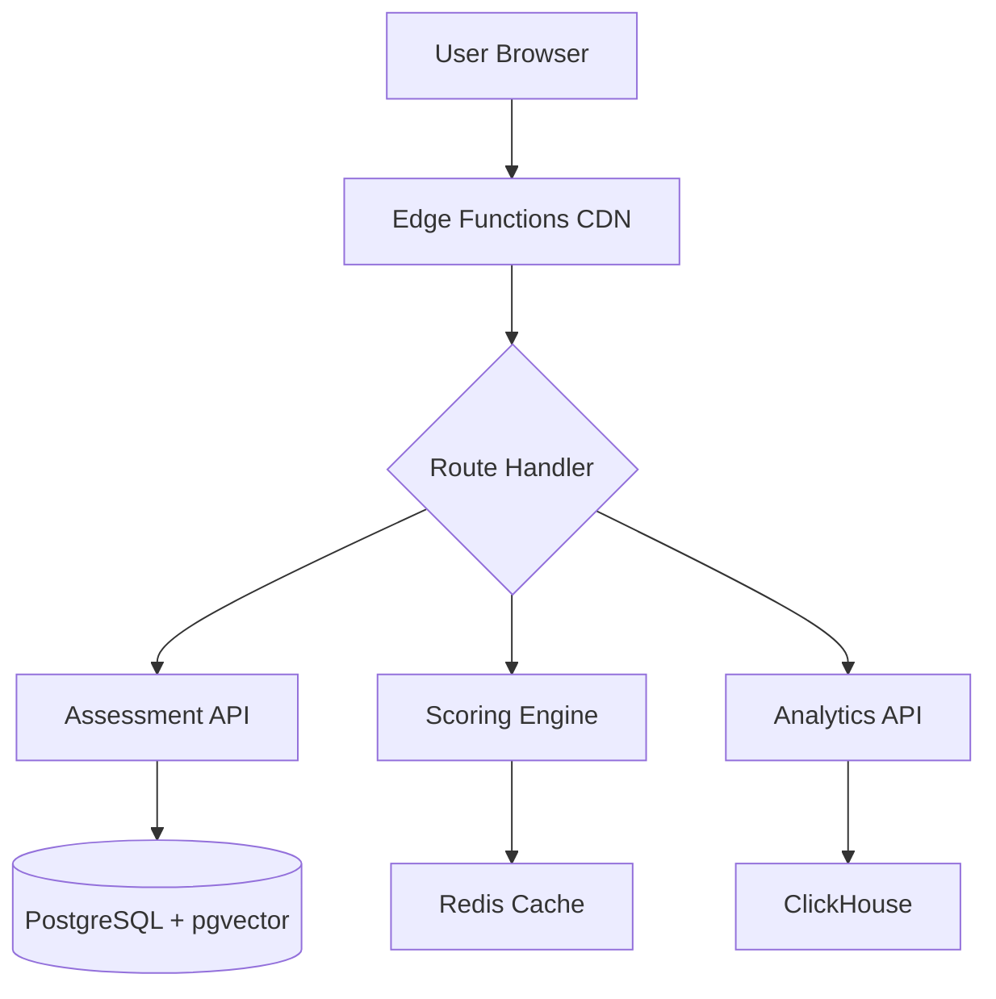
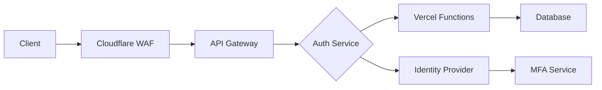

# AI Readiness Assessment Tool - Technical Architecture
## July 2025 Deployment Strategy

### Executive Summary
This document outlines the optimal technical architecture for the AI Readiness Assessment Tool, designed to scale from 10K to 100K assessments per month while maintaining sub-200ms response times globally. The architecture emphasizes serverless patterns, edge computing, and AI-driven scoring algorithms.

---

## 1. Serverless Architecture Design

### 1.1 Platform Comparison

| Feature | Vercel Functions | Netlify Functions | AWS Lambda |
|---------|------------------|-------------------|------------|
| **Cold Start** | 50-100ms | 100-200ms | 200-500ms |
| **Edge Support** | Native Edge Functions | Edge Handlers | Lambda@Edge |
| **Pricing (100K/mo)** | $150-300 | $200-400 | $100-250 |
| **Auto-scaling** | Automatic | Automatic | Configurable |
| **Max Execution** | 10s (Pro: 60s) | 10s (26s background) | 15 min |
| **Regional Coverage** | 23 regions | 16 regions | 30+ regions |

### 1.2 Recommended Architecture: Vercel Edge Functions



### 1.3 Cold Start Optimization
- **Pre-warmed Functions**: Keep 5-10 instances warm using scheduled pings
- **Lightweight Dependencies**: Bundle size < 50KB per function
- **Edge Runtime**: Use Vercel Edge Runtime for < 50ms cold starts
- **Connection Pooling**: Maintain persistent DB connections via Prisma Data Proxy

### 1.4 Serverless Database Options

#### Recommended: Neon (PostgreSQL)
```typescript
// Connection with serverless driver
import { neon } from '@neondatabase/serverless';

const sql = neon(process.env.DATABASE_URL);

export async function saveAssessment(data: AssessmentData) {
  return sql`
    INSERT INTO assessments (data, score, created_at)
    VALUES (${data}, ${calculateScore(data)}, NOW())
    RETURNING id, score
  `;
}
```

**Comparison:**
- **Neon**: Best cold starts (5ms), serverless scaling, pgvector support
- **PlanetScale**: MySQL-based, excellent vitess sharding, 10ms cold starts
- **Supabase**: Full BaaS features, 15ms cold starts, built-in auth

### 1.5 Cost Analysis (Monthly)

| Volume | Infrastructure | Database | CDN | Total |
|--------|----------------|----------|-----|-------|
| 10K assessments | $50 | $25 | $10 | $85 |
| 50K assessments | $150 | $75 | $30 | $255 |
| 100K assessments | $300 | $150 | $50 | $500 |

---

## 2. Scoring Algorithm Implementation

### 2.1 Multi-Dimensional Scoring Framework

```typescript
interface ScoringDimensions {
  strategy: {
    weight: 0.25;
    subFactors: {
      vision: number;        // 0-100
      leadership: number;    // 0-100
      roadmap: number;      // 0-100
    };
  };
  data: {
    weight: 0.20;
    subFactors: {
      quality: number;      // 0-100
      accessibility: number; // 0-100
      governance: number;   // 0-100
    };
  };
  technology: {
    weight: 0.20;
    subFactors: {
      infrastructure: number; // 0-100
      tools: number;         // 0-100
      integration: number;   // 0-100
    };
  };
  talent: {
    weight: 0.20;
    subFactors: {
      skills: number;        // 0-100
      culture: number;       // 0-100
      training: number;      // 0-100
    };
  };
  culture: {
    weight: 0.15;
    subFactors: {
      innovation: number;    // 0-100
      agility: number;       // 0-100
      risk_appetite: number; // 0-100
    };
  };
}
```

### 2.2 Weighted Scoring Algorithm

```typescript
// Edge Function: /api/scoring/calculate
export async function calculateAIReadinessScore(
  assessment: AssessmentData,
  industry: Industry,
  companySize: CompanySize
): Promise<ScoringResult> {
  // Get industry-specific weights
  const weights = await getIndustryWeights(industry, companySize);
  
  // Calculate dimension scores
  const dimensions = {
    strategy: calculateStrategyScore(assessment, weights.strategy),
    data: calculateDataScore(assessment, weights.data),
    technology: calculateTechnologyScore(assessment, weights.technology),
    talent: calculateTalentScore(assessment, weights.talent),
    culture: calculateCultureScore(assessment, weights.culture)
  };
  
  // Apply weighted calculation
  const totalScore = Object.entries(dimensions).reduce(
    (sum, [key, score]) => sum + (score * weights[key]),
    0
  );
  
  // Generate percentile ranking
  const percentile = await calculatePercentile(totalScore, industry, companySize);
  
  return {
    totalScore,
    dimensions,
    percentile,
    maturityLevel: getMaturityLevel(totalScore),
    recommendations: generateRecommendations(dimensions)
  };
}
```

### 2.3 Real-time Progressive Scoring

```typescript
// WebSocket implementation for live scoring updates
import { createClient } from '@supabase/supabase-js';

export function streamScoreUpdates(assessmentId: string) {
  const supabase = createClient(
    process.env.SUPABASE_URL!,
    process.env.SUPABASE_ANON_KEY!
  );
  
  return supabase
    .channel(`assessment:${assessmentId}`)
    .on('postgres_changes', {
      event: 'UPDATE',
      schema: 'public',
      table: 'assessments',
      filter: `id=eq.${assessmentId}`
    }, payload => {
      // Emit score updates to client
      return payload.new.score;
    })
    .subscribe();
}
```

### 2.4 Benchmarking Engine

```sql
-- Percentile calculation with industry segmentation
WITH industry_scores AS (
  SELECT 
    score,
    PERCENT_RANK() OVER (
      PARTITION BY industry, company_size 
      ORDER BY score
    ) as percentile
  FROM assessments
  WHERE 
    created_at >= NOW() - INTERVAL '6 months'
    AND industry = $1
    AND company_size = $2
)
SELECT 
  percentile * 100 as percentile_rank
FROM industry_scores
WHERE score <= $3
ORDER BY score DESC
LIMIT 1;
```

### 2.5 Statistical Validation

```typescript
// Validate scoring consistency using statistical methods
export async function validateScoringModel(
  testData: AssessmentData[]
): Promise<ValidationResult> {
  const results = await Promise.all(
    testData.map(data => calculateAIReadinessScore(data))
  );
  
  // Calculate Cronbach's Alpha for internal consistency
  const alpha = calculateCronbachAlpha(results);
  
  // Perform factor analysis
  const factors = performFactorAnalysis(results);
  
  // Check for normal distribution
  const distribution = checkNormalDistribution(results);
  
  return {
    cronbachAlpha: alpha, // Target: > 0.7
    factorLoadings: factors,
    distributionTest: distribution,
    isValid: alpha > 0.7 && distribution.pValue > 0.05
  };
}
```

---

## 3. Data Architecture

### 3.1 PostgreSQL with pgvector

```sql
-- Main assessment table with vector embeddings
CREATE TABLE assessments (
  id UUID PRIMARY KEY DEFAULT gen_random_uuid(),
  user_id UUID REFERENCES users(id),
  company_id UUID REFERENCES companies(id),
  
  -- Assessment data
  responses JSONB NOT NULL,
  score DECIMAL(5,2) NOT NULL,
  dimensions JSONB NOT NULL,
  
  -- Vector embedding for semantic search
  embedding vector(768),
  
  -- Metadata
  industry VARCHAR(50) NOT NULL,
  company_size VARCHAR(20) NOT NULL,
  created_at TIMESTAMPTZ DEFAULT NOW(),
  updated_at TIMESTAMPTZ DEFAULT NOW()
);

-- Index for vector similarity search
CREATE INDEX idx_embedding ON assessments 
USING ivfflat (embedding vector_cosine_ops)
WITH (lists = 100);

-- Partial index for active assessments
CREATE INDEX idx_active_assessments ON assessments(created_at DESC)
WHERE completed = true;
```

### 3.2 Redis Cache Architecture

```typescript
// Redis caching strategy
import { Redis } from '@upstash/redis';

const redis = new Redis({
  url: process.env.UPSTASH_REDIS_URL!,
  token: process.env.UPSTASH_REDIS_TOKEN!
});

// Cache layers
const CACHE_KEYS = {
  assessment: (id: string) => `assessment:${id}`,
  score: (id: string) => `score:${id}`,
  percentile: (industry: string, size: string) => 
    `percentile:${industry}:${size}`,
  session: (sessionId: string) => `session:${sessionId}`
};

// Cache with TTL
export async function cacheAssessmentScore(
  assessmentId: string,
  score: ScoringResult
): Promise<void> {
  await redis.setex(
    CACHE_KEYS.score(assessmentId),
    3600, // 1 hour TTL
    JSON.stringify(score)
  );
}
```

### 3.3 S3-Compatible Storage (Cloudflare R2)

```typescript
// Report storage with Cloudflare R2
import { S3Client, PutObjectCommand } from '@aws-sdk/client-s3';

const r2 = new S3Client({
  region: 'auto',
  endpoint: `https://${process.env.CLOUDFLARE_ACCOUNT_ID}.r2.cloudflarestorage.com`,
  credentials: {
    accessKeyId: process.env.R2_ACCESS_KEY_ID!,
    secretAccessKey: process.env.R2_SECRET_ACCESS_KEY!,
  },
});

export async function storeReport(
  assessmentId: string,
  reportPdf: Buffer
): Promise<string> {
  const key = `reports/${assessmentId}/report.pdf`;
  
  await r2.send(new PutObjectCommand({
    Bucket: 'ai-assessments',
    Key: key,
    Body: reportPdf,
    ContentType: 'application/pdf',
    CacheControl: 'max-age=31536000', // 1 year
  }));
  
  return `https://reports.ai-assessment.com/${key}`;
}
```

### 3.4 Event Streaming Architecture

```typescript
// Using Kafka alternative - Redpanda Cloud
import { Kafka } from 'kafkajs';

const kafka = new Kafka({
  clientId: 'ai-assessment-tool',
  brokers: [process.env.REDPANDA_BROKER!],
  ssl: true,
  sasl: {
    mechanism: 'scram-sha-256',
    username: process.env.REDPANDA_USERNAME!,
    password: process.env.REDPANDA_PASSWORD!
  }
});

// Event producer
export async function publishAssessmentEvent(
  event: AssessmentEvent
): Promise<void> {
  const producer = kafka.producer();
  await producer.connect();
  
  await producer.send({
    topic: 'assessment-events',
    messages: [{
      key: event.assessmentId,
      value: JSON.stringify({
        ...event,
        timestamp: new Date().toISOString()
      })
    }]
  });
  
  await producer.disconnect();
}
```

### 3.5 GDPR-Compliant Data Retention

```sql
-- Automated data retention policies
CREATE OR REPLACE FUNCTION enforce_data_retention()
RETURNS void AS $$
BEGIN
  -- Anonymize assessments older than 2 years
  UPDATE assessments
  SET 
    user_id = NULL,
    responses = jsonb_build_object(
      'anonymized', true,
      'score', score,
      'dimensions', dimensions
    )
  WHERE 
    created_at < NOW() - INTERVAL '2 years'
    AND user_id IS NOT NULL;
  
  -- Delete PII from old sessions
  DELETE FROM assessment_sessions
  WHERE created_at < NOW() - INTERVAL '90 days';
  
  -- Archive old reports
  INSERT INTO archived_reports
  SELECT * FROM assessment_reports
  WHERE created_at < NOW() - INTERVAL '1 year';
  
  DELETE FROM assessment_reports
  WHERE created_at < NOW() - INTERVAL '1 year';
END;
$$ LANGUAGE plpgsql;

-- Schedule daily execution
CREATE EXTENSION IF NOT EXISTS pg_cron;
SELECT cron.schedule('enforce-retention', '0 2 * * *', 
  'SELECT enforce_data_retention()');
```

---

## 4. Security & Compliance

### 4.1 Zero-Trust Architecture



### 4.2 End-to-End Encryption

```typescript
// Client-side encryption for sensitive data
import { subtle } from 'crypto';

export class AssessmentEncryption {
  private publicKey: CryptoKey;
  
  async encryptResponses(
    responses: AssessmentResponses
  ): Promise<EncryptedData> {
    const data = new TextEncoder().encode(
      JSON.stringify(responses)
    );
    
    const encrypted = await subtle.encrypt(
      {
        name: 'RSA-OAEP',
        hash: 'SHA-256'
      },
      this.publicKey,
      data
    );
    
    return {
      data: btoa(String.fromCharCode(...new Uint8Array(encrypted))),
      keyId: await this.getKeyId(),
      algorithm: 'RSA-OAEP-256'
    };
  }
}

// Server-side decryption
export async function decryptAssessmentData(
  encrypted: EncryptedData
): Promise<AssessmentResponses> {
  const privateKey = await getPrivateKey(encrypted.keyId);
  
  const decrypted = await subtle.decrypt(
    {
      name: 'RSA-OAEP',
      hash: 'SHA-256'
    },
    privateKey,
    Buffer.from(encrypted.data, 'base64')
  );
  
  return JSON.parse(
    new TextDecoder().decode(decrypted)
  );
}
```

### 4.3 SOC 2 Type II Requirements

```yaml
# Infrastructure as Code - Terraform
resource "aws_cloudtrail" "audit_trail" {
  name                          = "ai-assessment-audit"
  s3_bucket_name               = aws_s3_bucket.audit_logs.id
  include_global_service_events = true
  enable_log_file_validation    = true
  
  event_selector {
    read_write_type           = "All"
    include_management_events = true
    
    data_resource {
      type   = "AWS::RDS::DBCluster"
      values = ["arn:aws:rds:*:*:cluster:ai-assessment-*"]
    }
  }
}

# Access controls
resource "aws_iam_policy" "least_privilege" {
  name = "ai-assessment-function-policy"
  
  policy = jsonencode({
    Version = "2012-10-17"
    Statement = [
      {
        Effect = "Allow"
        Action = [
          "secretsmanager:GetSecretValue"
        ]
        Resource = "arn:aws:secretsmanager:*:*:secret:ai-assessment/*"
      },
      {
        Effect = "Allow"
        Action = [
          "kms:Decrypt"
        ]
        Resource = aws_kms_key.assessment_key.arn
      }
    ]
  })
}
```

### 4.4 API Authentication Strategy

```typescript
// JWT with refresh token rotation
import { SignJWT, jwtVerify } from 'jose';

export class AuthService {
  private accessTokenSecret: Uint8Array;
  private refreshTokenSecret: Uint8Array;
  
  async generateTokens(userId: string): Promise<TokenPair> {
    // Short-lived access token (15 minutes)
    const accessToken = await new SignJWT({ 
      sub: userId,
      type: 'access' 
    })
      .setProtectedHeader({ alg: 'HS256' })
      .setIssuedAt()
      .setExpirationTime('15m')
      .sign(this.accessTokenSecret);
    
    // Long-lived refresh token (7 days)
    const refreshToken = await new SignJWT({ 
      sub: userId,
      type: 'refresh',
      family: crypto.randomUUID() // Token family for rotation
    })
      .setProtectedHeader({ alg: 'HS256' })
      .setIssuedAt()
      .setExpirationTime('7d')
      .sign(this.refreshTokenSecret);
    
    // Store refresh token family in Redis
    await redis.setex(
      `refresh:${userId}:${refreshToken}`,
      604800, // 7 days
      JSON.stringify({ family, used: false })
    );
    
    return { accessToken, refreshToken };
  }
  
  async refreshTokens(
    refreshToken: string
  ): Promise<TokenPair | null> {
    const payload = await this.verifyRefreshToken(refreshToken);
    if (!payload) return null;
    
    // Check if token has been used (replay attack)
    const stored = await redis.get(`refresh:${payload.sub}:${refreshToken}`);
    if (!stored || JSON.parse(stored).used) {
      // Revoke entire token family
      await this.revokeTokenFamily(payload.family);
      return null;
    }
    
    // Mark as used and generate new pair
    await redis.set(
      `refresh:${payload.sub}:${refreshToken}`,
      JSON.stringify({ ...JSON.parse(stored), used: true })
    );
    
    return this.generateTokens(payload.sub);
  }
}
```

### 4.5 GDPR/CCPA Compliance

```typescript
// Data privacy API endpoints
export const privacyRouter = createTRPCRouter({
  // Right to access
  exportUserData: protectedProcedure
    .mutation(async ({ ctx }) => {
      const data = await collectUserData(ctx.session.userId);
      const encrypted = await encryptExport(data);
      
      await sendEmail(ctx.session.email, {
        subject: 'Your AI Assessment Data Export',
        attachments: [{
          filename: 'ai-assessment-data.json.enc',
          content: encrypted
        }]
      });
      
      return { success: true };
    }),
  
  // Right to deletion
  deleteAccount: protectedProcedure
    .input(z.object({ 
      confirmation: z.literal('DELETE MY ACCOUNT') 
    }))
    .mutation(async ({ ctx, input }) => {
      // Soft delete with 30-day grace period
      await db.users.update({
        where: { id: ctx.session.userId },
        data: {
          deletedAt: new Date(),
          deleteScheduledFor: addDays(new Date(), 30)
        }
      });
      
      // Queue hard delete job
      await queue.add('delete-user-data', {
        userId: ctx.session.userId,
        scheduledFor: addDays(new Date(), 30)
      });
      
      return { success: true };
    }),
  
  // Consent management
  updateConsent: protectedProcedure
    .input(z.object({
      marketing: z.boolean(),
      analytics: z.boolean(),
      necessary: z.literal(true) // Always required
    }))
    .mutation(async ({ ctx, input }) => {
      await db.consent.upsert({
        where: { userId: ctx.session.userId },
        update: input,
        create: {
          userId: ctx.session.userId,
          ...input,
          ipAddress: ctx.req.ip,
          userAgent: ctx.req.headers['user-agent']
        }
      });
      
      return { success: true };
    })
});
```

---

## 5. Performance Optimization

### 5.1 CDN Strategy

```javascript
// Cloudflare Workers for edge caching
export default {
  async fetch(request, env) {
    const cacheKey = new Request(request.url, request);
    const cache = caches.default;
    
    // Check cache
    let response = await cache.match(cacheKey);
    
    if (!response) {
      // Forward to origin
      response = await fetch(request);
      
      // Cache static assets
      if (request.url.includes('/static/')) {
        response = new Response(response.body, response);
        response.headers.append('Cache-Control', 
          'public, max-age=31536000, immutable');
        await cache.put(cacheKey, response.clone());
      }
    }
    
    return response;
  }
};
```

### 5.2 Image Optimization Pipeline

```typescript
// Next.js Image component with optimization
import Image from 'next/image';
import { getPlaiceholder } from 'plaiceholder';

export async function OptimizedAssessmentImage({ 
  src, 
  alt 
}: ImageProps) {
  const { base64, img } = await getPlaiceholder(src);
  
  return (
    <Image
      {...img}
      alt={alt}
      placeholder="blur"
      blurDataURL={base64}
      sizes="(max-width: 640px) 100vw, 
             (max-width: 1024px) 50vw, 
             33vw"
      quality={85}
      loading="lazy"
    />
  );
}

// Cloudflare Image Resizing
export function getOptimizedImageUrl(
  originalUrl: string,
  options: ImageOptions
): string {
  const params = new URLSearchParams({
    width: options.width.toString(),
    quality: options.quality?.toString() || '85',
    format: options.format || 'auto',
    fit: options.fit || 'cover'
  });
  
  return `https://ai-assessment.com/cdn-cgi/image/${params}/${originalUrl}`;
}
```

### 5.3 Code Splitting Strategy

```typescript
// Route-based code splitting
export const routes = [
  {
    path: '/',
    component: lazy(() => import('./pages/Home'))
  },
  {
    path: '/assessment',
    component: lazy(() => import('./pages/Assessment')),
    preload: true // Preload critical routes
  },
  {
    path: '/results/:id',
    component: lazy(() => import('./pages/Results'))
  },
  {
    path: '/admin',
    component: lazy(() => 
      import(/* webpackPrefetch: true */ './pages/Admin')
    )
  }
];

// Component-level splitting
const HeavyVisualization = lazy(() => 
  import('./components/HeavyVisualization')
);

export function AssessmentResults() {
  const [showViz, setShowViz] = useState(false);
  
  return (
    <div>
      <button onClick={() => setShowViz(true)}>
        Show Detailed Analysis
      </button>
      
      {showViz && (
        <Suspense fallback={<LoadingSpinner />}>
          <HeavyVisualization />
        </Suspense>
      )}
    </div>
  );
}
```

### 5.4 SSR vs SSG Decision Matrix

```typescript
// pages/assessment/[id].tsx - Server-side rendering
export const getServerSideProps: GetServerSideProps = async ({ 
  params,
  req 
}) => {
  // Real-time data requires SSR
  const assessment = await fetchAssessment(params.id);
  const userProgress = await getUserProgress(req.session.userId);
  
  return {
    props: {
      assessment,
      userProgress
    }
  };
};

// pages/resources/[slug].tsx - Static generation
export const getStaticProps: GetStaticProps = async ({ params }) => {
  // Static content can be pre-generated
  const resource = await fetchResource(params.slug);
  
  return {
    props: {
      resource
    },
    revalidate: 3600 // ISR - revalidate every hour
  };
};

// Hybrid approach for assessment landing
export const getStaticProps: GetStaticProps = async () => {
  const industryBenchmarks = await fetchBenchmarks();
  
  return {
    props: {
      industryBenchmarks
    },
    revalidate: 86400 // Daily updates
  };
};
```

### 5.5 WebAssembly for Scoring Engine

```rust
// scoring_engine.rs - Compiled to WASM
use wasm_bindgen::prelude::*;
use serde::{Deserialize, Serialize};

#[derive(Deserialize)]
pub struct AssessmentData {
    responses: Vec<Response>,
    industry: String,
    company_size: String,
}

#[derive(Serialize)]
pub struct ScoreResult {
    total: f64,
    dimensions: Vec<DimensionScore>,
    percentile: f64,
}

#[wasm_bindgen]
pub fn calculate_score(data: JsValue) -> Result<JsValue, JsValue> {
    let assessment: AssessmentData = data.into_serde().unwrap();
    
    // High-performance scoring algorithm
    let mut total = 0.0;
    let mut dimensions = Vec::new();
    
    for response in &assessment.responses {
        let score = match response.question_type {
            QuestionType::Scale => response.value as f64 / 10.0,
            QuestionType::Multiple => calculate_multiple_choice_score(response),
            QuestionType::Matrix => calculate_matrix_score(response),
        };
        
        total += score * get_weight(&response.dimension);
        dimensions.push(DimensionScore {
            name: response.dimension.clone(),
            score,
        });
    }
    
    let result = ScoreResult {
        total: total * 100.0,
        dimensions,
        percentile: calculate_percentile(total, &assessment.industry),
    };
    
    Ok(JsValue::from_serde(&result).unwrap())
}

// JavaScript integration
import init, { calculate_score } from './scoring_engine_wasm';

export async function calculateAssessmentScore(
  data: AssessmentData
): Promise<ScoreResult> {
  await init(); // Initialize WASM module
  
  const result = calculate_score(data);
  return JSON.parse(result);
}
```

---

## 6. Scalability Patterns

### 6.1 Horizontal Scaling Strategy

```yaml
# Kubernetes deployment for API services
apiVersion: apps/v1
kind: Deployment
metadata:
  name: assessment-api
spec:
  replicas: 3
  strategy:
    type: RollingUpdate
    rollingUpdate:
      maxSurge: 1
      maxUnavailable: 0
  template:
    spec:
      containers:
      - name: api
        image: ai-assessment/api:latest
        resources:
          requests:
            cpu: 250m
            memory: 512Mi
          limits:
            cpu: 1000m
            memory: 1Gi
        env:
        - name: DATABASE_POOL_SIZE
          value: "25"
        livenessProbe:
          httpGet:
            path: /health
            port: 3000
          initialDelaySeconds: 30
          periodSeconds: 10
        readinessProbe:
          httpGet:
            path: /ready
            port: 3000
          initialDelaySeconds: 5
          periodSeconds: 5

---
apiVersion: autoscaling/v2
kind: HorizontalPodAutoscaler
metadata:
  name: assessment-api-hpa
spec:
  scaleTargetRef:
    apiVersion: apps/v1
    kind: Deployment
    name: assessment-api
  minReplicas: 3
  maxReplicas: 20
  metrics:
  - type: Resource
    resource:
      name: cpu
      target:
        type: Utilization
        averageUtilization: 70
  - type: Resource
    resource:
      name: memory
      target:
        type: Utilization
        averageUtilization: 80
  behavior:
    scaleUp:
      stabilizationWindowSeconds: 60
      policies:
      - type: Percent
        value: 100
        periodSeconds: 60
    scaleDown:
      stabilizationWindowSeconds: 300
      policies:
      - type: Percent
        value: 10
        periodSeconds: 60
```

### 6.2 Queue-Based Processing

```typescript
// BullMQ for report generation queue
import { Queue, Worker, QueueScheduler } from 'bullmq';
import { generatePDFReport } from './report-generator';

// Queue setup
const reportQueue = new Queue('report-generation', {
  connection: {
    host: process.env.REDIS_HOST,
    port: process.env.REDIS_PORT,
    password: process.env.REDIS_PASSWORD,
  },
  defaultJobOptions: {
    attempts: 3,
    backoff: {
      type: 'exponential',
      delay: 2000,
    },
    removeOnComplete: {
      count: 100, // Keep last 100 completed jobs
    },
    removeOnFail: {
      count: 1000, // Keep last 1000 failed jobs
    },
  },
});

// Add job to queue
export async function queueReportGeneration(
  assessmentId: string,
  priority: number = 0
): Promise<string> {
  const job = await reportQueue.add(
    'generate-pdf',
    {
      assessmentId,
      timestamp: new Date().toISOString(),
    },
    {
      priority,
      delay: priority > 5 ? 0 : 5000, // Delay low-priority jobs
    }
  );
  
  return job.id;
}

// Worker process
const reportWorker = new Worker(
  'report-generation',
  async (job) => {
    const { assessmentId } = job.data;
    
    // Update job progress
    await job.updateProgress(10);
    
    // Fetch assessment data
    const assessment = await fetchAssessment(assessmentId);
    await job.updateProgress(30);
    
    // Generate PDF
    const pdfBuffer = await generatePDFReport(assessment);
    await job.updateProgress(80);
    
    // Upload to storage
    const url = await uploadReport(assessmentId, pdfBuffer);
    await job.updateProgress(100);
    
    // Send notification
    await sendReportReadyNotification(assessment.userId, url);
    
    return { url, generatedAt: new Date().toISOString() };
  },
  {
    connection: {
      host: process.env.REDIS_HOST,
      port: process.env.REDIS_PORT,
      password: process.env.REDIS_PASSWORD,
    },
    concurrency: 5, // Process 5 reports simultaneously
  }
);

// Graceful shutdown
process.on('SIGTERM', async () => {
  await reportWorker.close();
  await reportQueue.close();
});
```

### 6.3 Database Connection Pooling

```typescript
// Prisma with connection pooling
import { PrismaClient } from '@prisma/client';
import { PrismaPg } from '@prisma/adapter-pg';
import { Pool } from 'pg';

// Configure connection pool
const pool = new Pool({
  connectionString: process.env.DATABASE_URL,
  max: 50, // Maximum pool size
  min: 10, // Minimum pool size
  idleTimeoutMillis: 30000,
  connectionTimeoutMillis: 2000,
  statement_timeout: 30000,
  query_timeout: 30000,
  ssl: {
    rejectUnauthorized: false,
  },
});

// Monitor pool health
pool.on('error', (err) => {
  console.error('Unexpected pool error', err);
  // Send alert to monitoring service
});

pool.on('connect', (client) => {
  client.query('SET statement_timeout = 30000');
});

// Create Prisma client with pool
const adapter = new PrismaPg(pool);
export const prisma = new PrismaClient({ 
  adapter,
  log: ['warn', 'error'],
});

// Connection pool metrics
export async function getPoolMetrics() {
  return {
    totalCount: pool.totalCount,
    idleCount: pool.idleCount,
    waitingCount: pool.waitingCount,
  };
}
```

### 6.4 Rate Limiting Implementation

```typescript
// Upstash Redis rate limiting
import { Ratelimit } from '@upstash/ratelimit';
import { Redis } from '@upstash/redis';

// Configure rate limiters
const rateLimiters = {
  // API rate limiting - sliding window
  api: new Ratelimit({
    redis: Redis.fromEnv(),
    limiter: Ratelimit.slidingWindow(100, '1 m'), // 100 requests per minute
    analytics: true,
  }),
  
  // Assessment submission - token bucket
  assessment: new Ratelimit({
    redis: Redis.fromEnv(),
    limiter: Ratelimit.tokenBucket(5, '1 h', 10), // 5 per hour, burst of 10
  }),
  
  // Report generation - fixed window
  reports: new Ratelimit({
    redis: Redis.fromEnv(),
    limiter: Ratelimit.fixedWindow(10, '1 d'), // 10 per day
  }),
};

// Middleware implementation
export async function rateLimitMiddleware(
  req: Request,
  type: keyof typeof rateLimiters = 'api'
): Promise<Response | null> {
  const identifier = req.headers.get('x-user-id') || 
                    req.headers.get('x-forwarded-for') || 
                    'anonymous';
  
  const { success, limit, reset, remaining } = await rateLimiters[type].limit(
    identifier
  );
  
  if (!success) {
    return new Response('Too Many Requests', {
      status: 429,
      headers: {
        'X-RateLimit-Limit': limit.toString(),
        'X-RateLimit-Remaining': remaining.toString(),
        'X-RateLimit-Reset': new Date(reset).toISOString(),
        'Retry-After': Math.floor((reset - Date.now()) / 1000).toString(),
      },
    });
  }
  
  return null; // Continue processing
}
```

### 6.5 Auto-scaling Configuration

```typescript
// Vercel Edge Function configuration
export const config = {
  runtime: 'edge',
  regions: ['iad1', 'sfo1', 'sin1', 'syd1', 'fra1'], // Multi-region
  maxDuration: 30, // 30 seconds max
};

// AWS Lambda auto-scaling
const lambdaScalingPolicy = {
  targetValue: 0.7, // Target 70% concurrency utilization
  scaleInCooldown: 60,
  scaleOutCooldown: 0,
  predefinedMetricType: 'LambdaConcurrentExecutions',
};

// Database read replica auto-scaling
export const databaseScalingRules = {
  minReplicas: 1,
  maxReplicas: 5,
  metrics: [
    {
      type: 'cpu',
      targetValue: 70,
    },
    {
      type: 'connections',
      targetValue: 80,
    },
    {
      type: 'replication_lag',
      targetValue: 1000, // 1 second max lag
    },
  ],
  scaleUpPolicy: {
    incrementPercent: 100, // Double capacity
    cooldownPeriod: 300, // 5 minutes
  },
  scaleDownPolicy: {
    decrementPercent: 50, // Halve capacity
    cooldownPeriod: 900, // 15 minutes
  },
};
```

---

## Implementation Roadmap

### Phase 1: Foundation (Weeks 1-4)
- [ ] Set up Vercel project with Edge Functions
- [ ] Configure Neon PostgreSQL with pgvector
- [ ] Implement basic scoring algorithm
- [ ] Set up Redis caching layer
- [ ] Create authentication system

### Phase 2: Core Features (Weeks 5-8)
- [ ] Build assessment wizard UI
- [ ] Implement real-time scoring engine
- [ ] Set up event streaming with Redpanda
- [ ] Create report generation queue
- [ ] Implement GDPR compliance features

### Phase 3: Performance (Weeks 9-12)
- [ ] Compile WASM scoring module
- [ ] Implement CDN strategy
- [ ] Set up monitoring and alerting
- [ ] Configure auto-scaling policies
- [ ] Performance testing and optimization

### Phase 4: Security & Compliance (Weeks 13-16)
- [ ] Complete SOC 2 compliance checklist
- [ ] Implement end-to-end encryption
- [ ] Set up audit logging
- [ ] Security penetration testing
- [ ] Documentation and training

### Phase 5: Launch Preparation (Weeks 17-20)
- [ ] Load testing (100K assessments/month)
- [ ] Disaster recovery testing
- [ ] Beta testing with select clients
- [ ] Marketing site optimization
- [ ] July 2025 production deployment

## Monitoring & Operations

### Key Metrics Dashboard
```typescript
export const monitoringMetrics = {
  // Business metrics
  assessmentsPerHour: 'avg(rate(assessments_completed[1h]))',
  conversionRate: 'sum(assessments_completed) / sum(assessments_started)',
  averageCompletionTime: 'histogram_quantile(0.95, assessment_duration)',
  
  // Performance metrics
  apiLatencyP95: 'histogram_quantile(0.95, api_request_duration)',
  scoringLatencyP99: 'histogram_quantile(0.99, scoring_duration)',
  databaseQueryTime: 'avg(pg_query_duration)',
  
  // Infrastructure metrics
  functionColdStarts: 'sum(rate(function_cold_starts[5m]))',
  cacheHitRate: 'sum(cache_hits) / sum(cache_requests)',
  errorRate: 'sum(rate(errors[5m])) / sum(rate(requests[5m]))',
};
```

This architecture provides a robust, scalable foundation for the AI Readiness Assessment Tool that can handle 100K+ assessments per month while maintaining excellent performance and security standards.