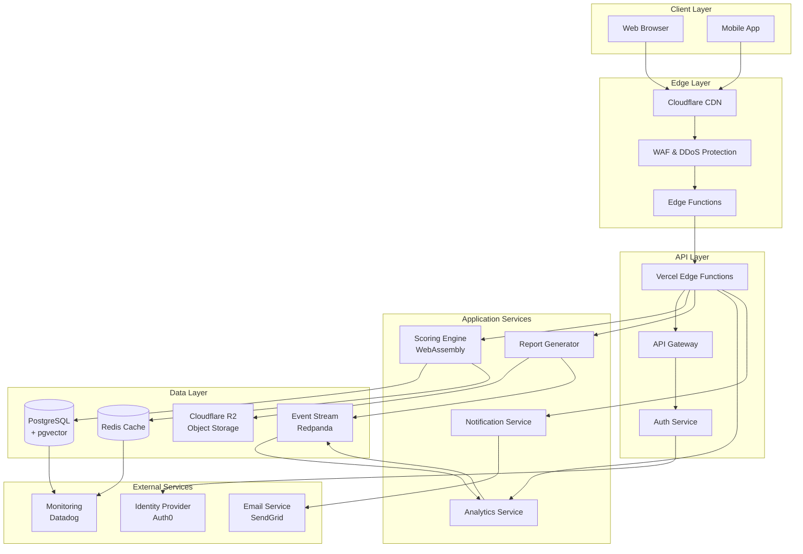
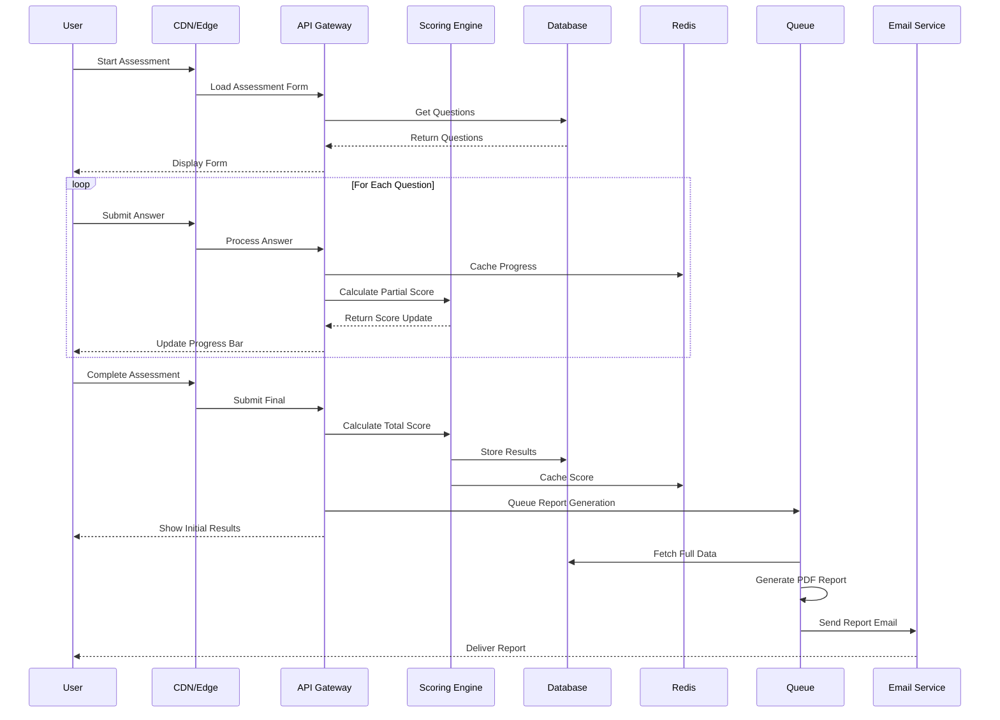
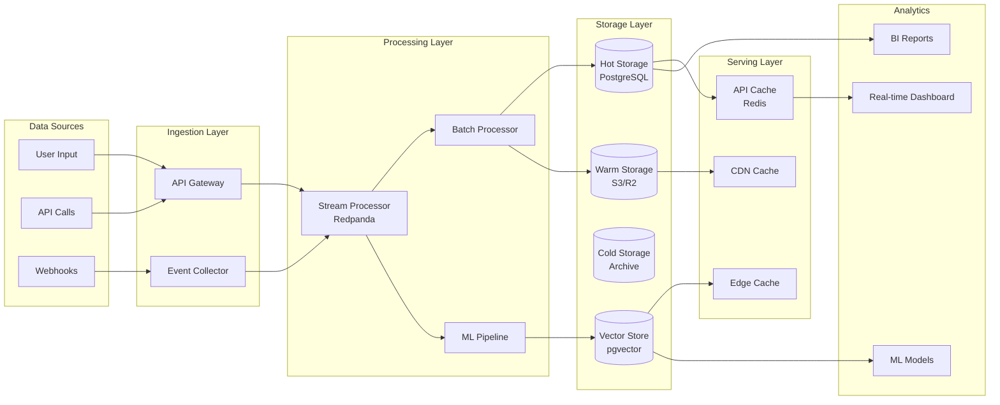
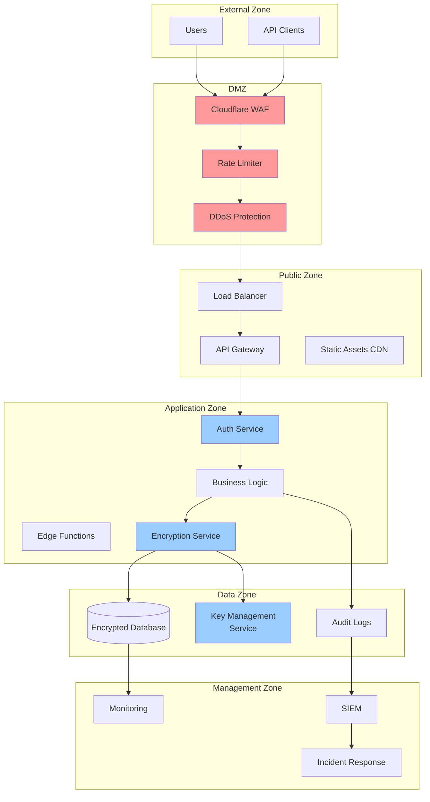
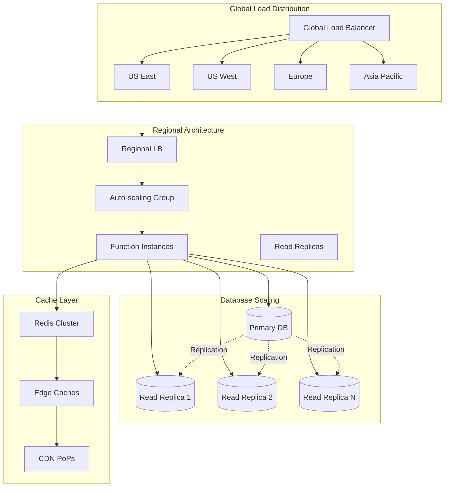
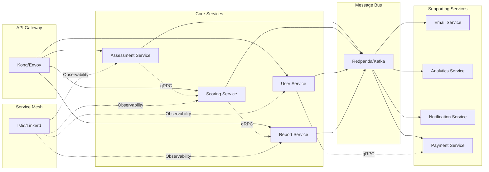
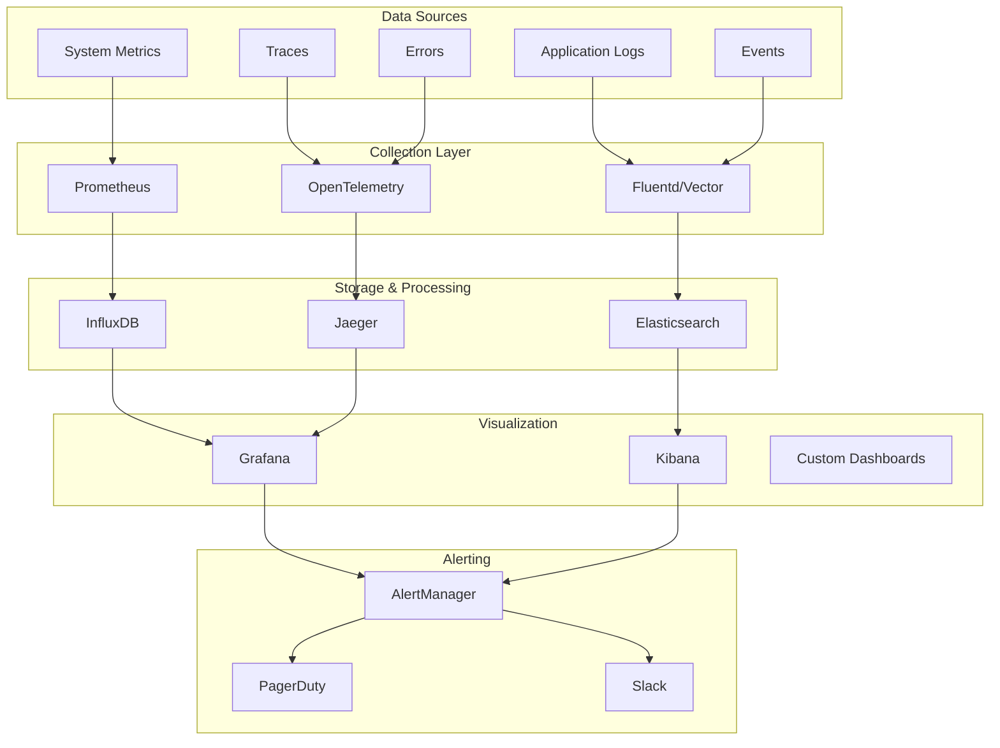

# AI Readiness Assessment Tool - Architecture Diagrams

## 1. High-Level System Architecture

## 2. Assessment Flow Architecture

## 3. Data Flow Architecture

## 4. Security Architecture

## 5. Scaling Architecture

## 6. Microservices Communication

## 7. Deployment Pipeline

```mermaid
graph LR
    subgraph "Development"
        A[Local Dev]
        B[Feature Branch]
        C[Unit Tests]
    end
    
    subgraph "CI/CD Pipeline"
        D[GitHub Actions]
        E[Build & Test]
        F[Security Scan]
        G[Container Build]
    end
    
    subgraph "Staging"
        H[Deploy to Staging]
        I[Integration Tests]
        J[Performance Tests]
        K[Manual QA]
    end
    
    subgraph "Production"
        L[Blue Environment]
        M[Green Environment]
        N[Canary Deploy]
        O[Full Deploy]
    end
    
    subgraph "Monitoring"
        P[Health Checks]
        Q[Metrics]
        R[Alerts]
    end
    
    A --> B
    B --> C
    C --> D
    
    D --> E
    E --> F
    F --> G
    
    G --> H
    H --> I
    I --> J
    J --> K
    
    K --> N
    N --> L
    N --> M
    
    L --> O
    M --> O
    
    O --> P
    P --> Q
    Q --> R
    
    style F fill:#ff9999
    style P fill:#99ff99
    style R fill:#ffff99
```

## 8. Monitoring & Observability Stack

These diagrams provide a comprehensive visual representation of the AI Readiness Assessment Tool architecture, showing how different components interact and scale to handle the expected load of 100K assessments per month.