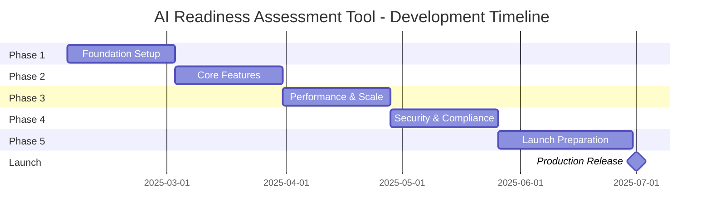

# AI Readiness Assessment Tool - Implementation Roadmap
## Target Launch: July 2025

### Executive Timeline Overview



---

## Phase 1: Foundation Setup (February 3 - March 2, 2025)

### Week 1: Infrastructure & Architecture Setup
**Sprint Goal**: Establish development environment and core infrastructure

#### Deliverables:
- [ ] **Day 1-2**: Project Initialization
  - Create GitHub repository with branch protection rules
  - Set up Next.js 14 project with TypeScript
  - Configure ESLint, Prettier, and Husky
  - Initialize Terraform workspace
  
- [ ] **Day 3-4**: Infrastructure Setup
  - Configure Vercel project and environments
  - Set up Neon PostgreSQL database
  - Configure Upstash Redis instance
  - Set up Cloudflare account and zones
  
- [ ] **Day 5**: CI/CD Pipeline
  - GitHub Actions workflows for testing
  - Automated deployment pipeline
  - Environment variable management
  - Dependency scanning with Snyk

#### Success Metrics:
- Development environment fully operational
- CI/CD pipeline passing all checks
- Infrastructure provisioned and accessible

### Week 2: Authentication & Core Architecture
**Sprint Goal**: Implement secure authentication and base architecture

#### Deliverables:
- [ ] **Day 1-2**: Authentication System
  ```typescript
  // Implement NextAuth.js with:
  - Email/password authentication
  - OAuth providers (Google, Microsoft)
  - JWT token management
  - Session handling with Redis
  ```

- [ ] **Day 3-4**: Database Schema
  ```sql
  -- Core tables:
  - users (with roles and permissions)
  - companies (multi-tenant support)
  - assessments (main assessment data)
  - assessment_responses (individual answers)
  - assessment_scores (calculated scores)
  ```

- [ ] **Day 5**: API Architecture
  - Set up tRPC router structure
  - Implement base middleware
  - Error handling framework
  - Request validation with Zod

#### Success Metrics:
- Users can register and authenticate
- Database migrations executed successfully
- API endpoints responding correctly

### Week 3: Design System & UI Foundation
**Sprint Goal**: Establish consistent design system and base components

#### Deliverables:
- [ ] **Day 1-2**: Design System Setup
  - Tailwind CSS configuration
  - Color palette and typography
  - Dark mode implementation
  - Component library structure

- [ ] **Day 3-4**: Core Components
  ```typescript
  // Essential components:
  - Button, Input, Select, Card
  - Modal, Toast, Skeleton
  - Navigation, Layout
  - Form components with react-hook-form
  ```

- [ ] **Day 5**: Page Layouts
  - Marketing landing page
  - Dashboard layout
  - Assessment wizard layout
  - Results page template

#### Success Metrics:
- Storybook deployed with all components
- Consistent design across all pages
- Accessibility audit passing (WCAG 2.1 AA)

### Week 4: Assessment Wizard Foundation
**Sprint Goal**: Build the core assessment flow infrastructure

#### Deliverables:
- [ ] **Day 1-2**: Wizard Architecture
  - Multi-step form implementation
  - Progress tracking system
  - State management with Zustand
  - Form validation logic

- [ ] **Day 3-4**: Question Engine
  - Question type components
  - Dynamic question loading
  - Answer persistence to Redis
  - Progress save/resume functionality

- [ ] **Day 5**: Basic Scoring Logic
  - Simple scoring algorithm (JavaScript)
  - Score calculation endpoints
  - Result storage structure

#### Success Metrics:
- Complete assessment flow working end-to-end
- Progress saved and resumable
- Basic scores calculated and stored

---

## Phase 2: Core Features (March 3 - March 30, 2025)

### Week 5: WebAssembly Scoring Engine
**Sprint Goal**: Implement high-performance scoring algorithm

#### Deliverables:
- [ ] **Day 1-3**: Rust Development
  ```rust
  // Core scoring modules:
  - Multi-dimensional scoring algorithm
  - Industry-specific weightings
  - Statistical normalization
  - Percentile calculations
  ```

- [ ] **Day 4-5**: WASM Integration
  - Compile Rust to WebAssembly
  - JavaScript bindings
  - Edge Function integration
  - Performance benchmarking

#### Success Metrics:
- Scoring engine processing < 50ms
- Accurate percentile rankings
- All test cases passing

### Week 6: Real-time Features
**Sprint Goal**: Add real-time updates and live scoring

#### Deliverables:
- [ ] **Day 1-2**: WebSocket Infrastructure
  - Set up WebSocket server
  - Client connection management
  - Authentication for WebSocket
  - Reconnection logic

- [ ] **Day 3-4**: Live Updates
  - Real-time score updates
  - Progress synchronization
  - Collaborative features
  - Presence indicators

- [ ] **Day 5**: Event Streaming
  - Redpanda Cloud setup
  - Event producers and consumers
  - Event schema definitions

#### Success Metrics:
- Real-time updates working reliably
- < 100ms latency for updates
- Event stream processing operational

### Week 7: Report Generation System
**Sprint Goal**: Automated PDF report generation

#### Deliverables:
- [ ] **Day 1-2**: Report Templates
  - PDF template design
  - Dynamic content injection
  - Chart and graph generation
  - Branding customization

- [ ] **Day 3-4**: Queue System
  - BullMQ setup with Redis
  - Worker processes
  - Priority queue logic
  - Retry mechanisms

- [ ] **Day 5**: Storage & Delivery
  - Cloudflare R2 integration
  - Signed URL generation
  - Email delivery system
  - Download tracking

#### Success Metrics:
- Reports generated within 2 minutes
- Professional PDF output quality
- Reliable delivery system

### Week 8: Analytics & Insights
**Sprint Goal**: Comprehensive analytics dashboard

#### Deliverables:
- [ ] **Day 1-3**: Analytics Engine
  - Data aggregation pipelines
  - Industry benchmarking
  - Trend analysis
  - Predictive insights

- [ ] **Day 4-5**: Dashboard Implementation
  - Executive dashboard
  - Detailed analytics views
  - Export capabilities
  - Scheduled reports

#### Success Metrics:
- Dashboard loading < 2 seconds
- Accurate benchmarking data
- Insights generating value

---

## Phase 3: Performance & Scale (March 31 - April 27, 2025)

### Week 9: Performance Optimization
**Sprint Goal**: Optimize for speed and efficiency

#### Deliverables:
- [ ] **Day 1-2**: Frontend Optimization
  - Code splitting implementation
  - Lazy loading components
  - Image optimization pipeline
  - Bundle size reduction

- [ ] **Day 3-4**: Backend Optimization
  - Database query optimization
  - Connection pooling
  - Caching strategy implementation
  - Edge function optimization

- [ ] **Day 5**: CDN Configuration
  - Cloudflare optimization rules
  - Cache headers configuration
  - Static asset optimization

#### Success Metrics:
- Lighthouse score > 95
- Time to Interactive < 2s
- API response time p95 < 200ms

### Week 10: Scaling Infrastructure
**Sprint Goal**: Prepare for high-volume traffic

#### Deliverables:
- [ ] **Day 1-2**: Auto-scaling Setup
  - Horizontal scaling configuration
  - Load balancer setup
  - Database read replicas
  - Redis cluster configuration

- [ ] **Day 3-4**: Queue Scaling
  - Worker auto-scaling
  - Queue monitoring
  - Dead letter queues
  - Priority queue optimization

- [ ] **Day 5**: Monitoring Setup
  - Datadog integration
  - Custom metrics and dashboards
  - Alert configuration
  - SLA monitoring

#### Success Metrics:
- Successfully handle 1000 concurrent users
- Auto-scaling responding within 30 seconds
- Zero downtime during scaling events

### Week 11: Load Testing & Optimization
**Sprint Goal**: Validate system under load

#### Deliverables:
- [ ] **Day 1-3**: Load Testing
  ```javascript
  // k6 test scenarios:
  - Baseline load (100 users)
  - Stress test (1000 users)
  - Spike test (5000 users)
  - Soak test (24 hours)
  ```

- [ ] **Day 4-5**: Performance Tuning
  - Bottleneck identification
  - Query optimization
  - Caching improvements
  - Infrastructure adjustments

#### Success Metrics:
- Handle 100K assessments/month
- < 0.1% error rate under load
- Consistent performance across regions

### Week 12: Disaster Recovery
**Sprint Goal**: Ensure system resilience

#### Deliverables:
- [ ] **Day 1-2**: Backup Systems
  - Automated database backups
  - Point-in-time recovery
  - Cross-region replication
  - Backup testing procedures

- [ ] **Day 3-4**: Failover Mechanisms
  - Multi-region deployment
  - Automatic failover
  - Health check systems
  - Circuit breakers

- [ ] **Day 5**: DR Testing
  - Disaster recovery drills
  - Recovery time testing
  - Data integrity validation

#### Success Metrics:
- RTO (Recovery Time Objective) < 1 hour
- RPO (Recovery Point Objective) < 5 minutes
- Successful DR drill completion

---

## Phase 4: Security & Compliance (April 28 - May 25, 2025)

### Week 13: Security Implementation
**Sprint Goal**: Comprehensive security measures

#### Deliverables:
- [ ] **Day 1-2**: Encryption
  - End-to-end encryption
  - Data at rest encryption
  - Key management service
  - Certificate management

- [ ] **Day 3-4**: Access Control
  - Role-based access control
  - API authentication
  - Rate limiting
  - DDoS protection

- [ ] **Day 5**: Security Headers
  - CSP implementation
  - HSTS configuration
  - Security headers audit

#### Success Metrics:
- A+ rating on SecurityHeaders.com
- Pass OWASP Top 10 audit
- Zero critical vulnerabilities

### Week 14: Compliance Implementation
**Sprint Goal**: Meet regulatory requirements

#### Deliverables:
- [ ] **Day 1-3**: GDPR Compliance
  - Privacy policy implementation
  - Consent management
  - Data export functionality
  - Right to deletion

- [ ] **Day 4-5**: SOC 2 Preparation
  - Audit logging
  - Access controls documentation
  - Security policies
  - Compliance monitoring

#### Success Metrics:
- GDPR compliance checklist complete
- SOC 2 audit ready
- Privacy controls operational

### Week 15: Penetration Testing
**Sprint Goal**: External security validation

#### Deliverables:
- [ ] **Day 1-3**: Penetration Test
  - External security firm engagement
  - Application security testing
  - Infrastructure testing
  - Social engineering tests

- [ ] **Day 4-5**: Remediation
  - Fix identified vulnerabilities
  - Security patch implementation
  - Retest critical issues

#### Success Metrics:
- No critical vulnerabilities
- All high-risk issues resolved
- Security sign-off received

### Week 16: Audit & Documentation
**Sprint Goal**: Complete compliance documentation

#### Deliverables:
- [ ] **Day 1-3**: Documentation
  - API documentation
  - Security runbooks
  - Incident response plan
  - Compliance reports

- [ ] **Day 4-5**: Training Materials
  - Admin documentation
  - User guides
  - Video tutorials
  - FAQ system

#### Success Metrics:
- Complete documentation coverage
- Compliance audit passed
- Team trained on procedures

---

## Phase 5: Launch Preparation (May 26 - June 30, 2025)

### Week 17-18: Beta Testing
**Sprint Goal**: Real-world validation with beta users

#### Deliverables:
- [ ] Beta user recruitment (50 companies)
- [ ] Beta testing environment setup
- [ ] Feedback collection system
- [ ] Issue tracking and prioritization
- [ ] Weekly beta user calls
- [ ] Performance monitoring
- [ ] Bug fixes and improvements

#### Success Metrics:
- 50+ beta assessments completed
- < 5% critical issue rate
- 8+ NPS score from beta users

### Week 19: Marketing Site Optimization
**Sprint Goal**: Optimize conversion funnel

#### Deliverables:
- [ ] Landing page A/B tests
- [ ] SEO optimization
- [ ] Content creation
- [ ] Social proof integration
- [ ] Pricing page optimization
- [ ] Demo video creation
- [ ] Case study development

#### Success Metrics:
- 5%+ conversion rate
- < 3s page load time
- SEO audit score > 90

### Week 20: Final Testing & Polish
**Sprint Goal**: Production readiness

#### Deliverables:
- [ ] End-to-end testing
- [ ] Performance validation
- [ ] Security final review
- [ ] Accessibility audit
- [ ] Cross-browser testing
- [ ] Mobile app testing
- [ ] Final bug fixes

#### Success Metrics:
- Zero critical bugs
- All acceptance criteria met
- Performance targets achieved

### Week 21: Launch Preparation
**Sprint Goal**: Final launch readiness

#### Deliverables:
- [ ] **Day 1-2**: Infrastructure Check
  - Production environment validation
  - Scaling policies confirmed
  - Monitoring alerts tested
  - Backup systems verified

- [ ] **Day 3-4**: Launch Plan
  - Go-live checklist
  - Rollback procedures
  - Communication plan
  - Support team briefing

- [ ] **Day 5**: Soft Launch
  - Limited release to select users
  - Monitor system stability
  - Gather initial feedback

#### Success Metrics:
- All systems operational
- Launch plan approved
- Team ready for launch

---

## Launch Day: July 1, 2025

### Launch Day Activities
- [ ] 06:00 - Final system checks
- [ ] 08:00 - Enable production traffic
- [ ] 09:00 - Marketing announcement
- [ ] 10:00 - Press release
- [ ] All Day - Monitor systems
- [ ] 18:00 - Launch retrospective

### Post-Launch Support (Week 1)
- 24/7 monitoring for first week
- Daily standup meetings
- Rapid response team on standby
- Performance tracking
- User feedback collection

### Success Criteria
- System stability maintained
- < 0.01% error rate
- Positive user feedback
- Media coverage achieved
- Business objectives met

---

## Risk Mitigation Plan

### Technical Risks
1. **Scaling Issues**
   - Mitigation: Early load testing, auto-scaling policies
   - Contingency: Manual scaling, traffic throttling

2. **Security Vulnerabilities**
   - Mitigation: Multiple security audits, penetration testing
   - Contingency: Rapid patch deployment, incident response

3. **Performance Degradation**
   - Mitigation: Continuous monitoring, performance budgets
   - Contingency: CDN expansion, caching optimization

### Business Risks
1. **Delayed Timeline**
   - Mitigation: 20% buffer in estimates, parallel workstreams
   - Contingency: Phased launch, feature prioritization

2. **Budget Overrun**
   - Mitigation: Weekly cost monitoring, reserved instances
   - Contingency: Feature scope reduction, extended timeline

3. **Low Adoption**
   - Mitigation: Beta user program, marketing preparation
   - Contingency: Pivot features, pricing adjustment

This comprehensive roadmap provides a clear path to successfully launching the AI Readiness Assessment Tool by July 2025, with built-in checkpoints and risk mitigation strategies.