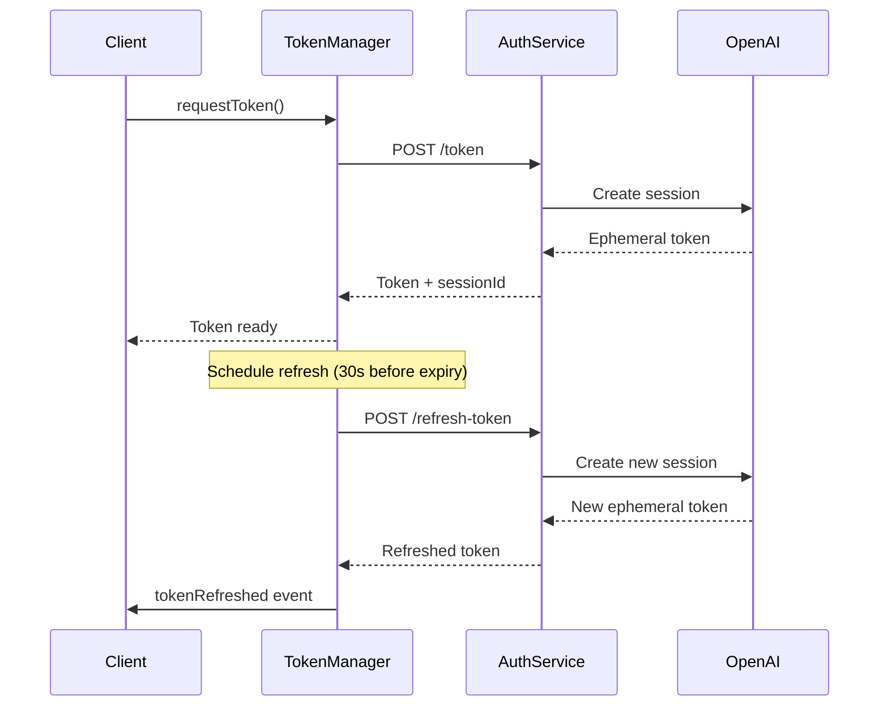

# OpenAI Realtime API Authentication Service

A comprehensive, production-ready authentication service for OpenAI's Realtime API that implements secure ephemeral token generation following OpenAI's security best practices.

## 🔒 Security Features

### Multi-Layer Security
- **Ephemeral Tokens**: 60-second token lifespan
- **Advanced Rate Limiting**: IP-based with sliding window algorithm
- **CORS Protection**: Configurable origin validation
- **Session Tracking**: Prevents session hijacking
- **Suspicious Activity Detection**: Automatic blocking of malicious patterns
- **Security Headers**: OWASP-compliant HTTP security headers

### Token Management
- **Automatic Refresh**: Client-side token renewal before expiration
- **Retry Logic**: Exponential backoff for failed requests
- **Session Persistence**: Server-side session tracking
- **Secure Storage**: Memory-only token storage (no localStorage)

## 📁 File Structure

```
src/
├── api/
│   ├── config/
│   │   └── security.ts          # Security configuration
│   └── middleware/
│       └── rateLimiter.ts       # Advanced rate limiting
├── pages/api/voice-agent/
│   ├── token.ts                 # Initial token generation
│   ├── refresh-token.ts         # Token refresh endpoint
│   └── health.ts                # Health monitoring
└── features/voice-agent/
    ├── services/
    │   └── tokenManager.ts      # Client-side token manager
    └── types/
        └── index.ts             # TypeScript definitions
```

## 🚀 Quick Start

### 1. Setup

Run the automated setup script:

```bash
chmod +x scripts/setup-auth-service.sh
./scripts/setup-auth-service.sh
```

### 2. Manual Configuration

If you prefer manual setup:

```bash
# Copy environment template
cp .env.example .env

# Edit environment variables
nano .env
```

Required environment variables:

```env
# OpenAI Configuration
OPENAI_API_KEY=sk-your-openai-api-key-here

# Voice Agent Configuration
ALLOWED_ORIGINS=http://localhost:4321,https://yoursite.com
VOICE_AGENT_RATE_LIMIT=10
VOICE_AGENT_TOKEN_DURATION=60
```

### 3. Development

```bash
# Install dependencies
npm install

# Start development server
npm run dev

# Test endpoints
curl -X POST http://localhost:4321/api/voice-agent/token
curl http://localhost:4321/api/voice-agent/health
```

## 🔧 API Endpoints

### POST /api/voice-agent/token
Generate a new ephemeral token for OpenAI Realtime API.

**Request:**
```http
POST /api/voice-agent/token
Content-Type: application/json
Origin: https://yoursite.com
```

**Response:**
```json
{
  "success": true,
  "token": "eph_1234567890abcdef",
  "expiresAt": 1640995200000,
  "sessionId": "session_1640995140_abc123"
}
```

**Rate Limiting:**
- 10 requests per minute per IP (configurable)
- Sliding window algorithm
- Automatic suspicious activity detection

### POST /api/voice-agent/refresh-token
Refresh an existing token before expiration.

**Request:**
```http
POST /api/voice-agent/refresh-token
Content-Type: application/json

{
  "sessionId": "session_1640995140_abc123"
}
```

**Response:**
```json
{
  "success": true,
  "token": "eph_0987654321fedcba",
  "expiresAt": 1640995260000,
  "sessionId": "session_1640995140_abc123"
}
```

**Security Features:**
- Session validation
- IP verification
- Refresh frequency limits
- Maximum refresh attempts per session

### GET /api/voice-agent/health
System health and monitoring endpoint.

**Response:**
```json
{
  "status": "healthy",
  "timestamp": 1640995200000,
  "uptime": 3600000,
  "services": {
    "openaiApi": { "status": "operational", "latency": 120 },
    "rateLimit": { "status": "operational" },
    "sessionTracking": { "status": "operational" }
  },
  "metrics": {
    "totalRequests": 1234,
    "activeSessions": 15,
    "totalRefreshes": 456,
    "errorRate": 0.05,
    "averageResponseTime": 145.6
  }
}
```

## 💻 Client-Side Usage

### TypeScript/JavaScript

```typescript
import { getTokenManager } from './features/voice-agent/services/tokenManager';

// Initialize token manager
const tokenManager = getTokenManager({
  baseUrl: 'https://yoursite.com',
  refreshThresholdSeconds: 30,
  enableAutoRefresh: true
});

// Event listeners
tokenManager.on('tokenRefreshed', (token) => {
  console.log('New token:', token.token);
  // Use token with OpenAI Realtime API
});

tokenManager.on('tokenExpired', () => {
  console.log('Token expired, please reconnect');
});

// Request initial token
try {
  const token = await tokenManager.requestToken();
  // Use token.token with OpenAI Realtime WebSocket
} catch (error) {
  console.error('Token request failed:', error);
}
```

### React Component Example

```tsx
import React, { useEffect, useState } from 'react';
import { getTokenManager } from '../services/tokenManager';

export const VoiceAgent: React.FC = () => {
  const [token, setToken] = useState<string | null>(null);
  const [status, setStatus] = useState<'disconnected' | 'connecting' | 'connected'>('disconnected');

  useEffect(() => {
    const tokenManager = getTokenManager();
    
    tokenManager.on('tokenRefreshed', (newToken) => {
      setToken(newToken.token);
      setStatus('connected');
    });
    
    tokenManager.on('tokenExpired', () => {
      setToken(null);
      setStatus('disconnected');
    });
    
    // Request initial token
    tokenManager.requestToken().catch(console.error);
    
    return () => {
      tokenManager.destroy();
    };
  }, []);

  const connect = async () => {
    setStatus('connecting');
    try {
      const tokenManager = getTokenManager();
      const tokenData = await tokenManager.requestToken();
      // Initialize OpenAI Realtime connection with tokenData.token
    } catch (error) {
      setStatus('disconnected');
      console.error('Connection failed:', error);
    }
  };

  return (
    <div>
      <p>Status: {status}</p>
      <button onClick={connect} disabled={status === 'connecting'}>
        Connect to Voice Agent
      </button>
    </div>
  );
};
```

## 🛡️ Security Best Practices

### Server-Side Security

1. **Environment Variables**
   ```bash
   # Never commit .env to version control
   echo ".env" >> .gitignore
   
   # Set secure file permissions
   chmod 600 .env
   ```

2. **Rate Limiting Configuration**
   ```typescript
   // Production settings
   const rateLimiter = createTokenRateLimiter({
     windowMs: 60 * 1000,        // 1 minute
     maxRequests: 5,             // Conservative limit
     suspiciousActivityThreshold: 3
   });
   ```

3. **CORS Configuration**
   ```env
   # Only allow your domains
   ALLOWED_ORIGINS=https://yoursite.com,https://www.yoursite.com
   ```

### Client-Side Security

1. **Token Storage**
   ```typescript
   // ✅ Good: Memory-only storage
   const tokenManager = getTokenManager();
   
   // ❌ Bad: Never store in localStorage
   // localStorage.setItem('token', token);
   ```

2. **Error Handling**
   ```typescript
   tokenManager.on('tokenError', (error) => {
     // Log error for monitoring
     console.error('Token error:', error);
     
     // Show user-friendly message
     showNotification('Connection issue. Please try again.');
   });
   ```

### Production Deployment

1. **HTTPS Only**
   ```nginx
   # Nginx configuration
   server {
     listen 443 ssl;
     ssl_certificate /path/to/cert.pem;
     ssl_certificate_key /path/to/key.pem;
     
     # Security headers
     add_header Strict-Transport-Security "max-age=31536000; includeSubDomains" always;
     add_header X-Content-Type-Options nosniff;
     add_header X-Frame-Options DENY;
   }
   ```

2. **Environment Separation**
   ```bash
   # Production environment
   NODE_ENV=production
   OPENAI_API_KEY=sk-prod-key-here
   ALLOWED_ORIGINS=https://yoursite.com
   
   # Staging environment
   NODE_ENV=staging
   OPENAI_API_KEY=sk-staging-key-here
   ALLOWED_ORIGINS=https://staging.yoursite.com
   ```

## 📊 Monitoring and Logging

### Health Monitoring

```bash
# Check service health
curl https://yoursite.com/api/voice-agent/health

# Monitor specific metrics
curl -s https://yoursite.com/api/voice-agent/health | jq '.metrics'
```

### Log Analysis

The service provides structured logging for security events:

```typescript
// Security event logging
{
  timestamp: 1640995200000,
  event: "rate_limit_exceeded",
  clientIP: "192.168.1.100",
  userAgent: "Mozilla/5.0...",
  severity: "medium",
  details: { attempts: 15, window: 60000 }
}
```

### Alerts and Notifications

Set up monitoring for:
- High error rates (>5%)
- Suspicious activity patterns
- API key usage anomalies
- Service availability
- Response time degradation

## 🔄 Token Refresh Flow



## 🧪 Testing

### Unit Tests

```bash
# Run all tests
npm test

# Run specific test suites
npm test -- --grep "TokenManager"
npm test -- --grep "RateLimiter"
```

### Integration Tests

```bash
# Test endpoints
npm run test:integration

# Load testing
npm run test:load
```

### Security Testing

```bash
# Test rate limiting
for i in {1..20}; do
  curl -X POST http://localhost:4321/api/voice-agent/token &
done

# Test CORS
curl -X POST http://localhost:4321/api/voice-agent/token \
  -H "Origin: https://malicious-site.com"
```

## 📈 Performance Optimization

### Rate Limiting Optimization

For high-traffic applications, consider:

1. **Redis-based Rate Limiting**
   ```typescript
   // Replace in-memory storage with Redis
   import Redis from 'ioredis';
   const redis = new Redis(process.env.REDIS_URL);
   ```

2. **Distributed Session Storage**
   ```typescript
   // Store sessions in database
   const sessionStore = new DatabaseSessionStore();
   ```

### Caching Strategies

```typescript
// Cache health check results
const healthCache = new Map();
const CACHE_TTL = 30 * 1000; // 30 seconds
```

## 📝 Contributing

1. Fork the repository
2. Create a feature branch: `git checkout -b feature/amazing-feature`
3. Commit changes: `git commit -m 'Add amazing feature'`
4. Push to branch: `git push origin feature/amazing-feature`
5. Open a Pull Request

### Development Guidelines

- Follow TypeScript strict mode
- Add tests for new features
- Update documentation
- Follow security best practices
- Use conventional commits

## 📄 License

This project is licensed under the MIT License - see the [LICENSE](LICENSE) file for details.

## 🆘 Support

- **Documentation**: Check this README and inline code comments
- **Issues**: Open a GitHub issue for bugs or feature requests
- **Security**: Report security issues privately to [security@yoursite.com]
- **OpenAI API**: Refer to [OpenAI Documentation](https://platform.openai.com/docs/guides/realtime)

## 🔗 Related Resources

- [OpenAI Realtime API Documentation](https://platform.openai.com/docs/guides/realtime)
- [OpenAI Security Best Practices](https://platform.openai.com/docs/guides/safety-best-practices)
- [OWASP API Security Top 10](https://owasp.org/www-project-api-security/)
- [WebRTC Security Guidelines](https://webrtc-security.github.io/)

---

**⚠️ Security Notice**: This authentication service handles sensitive API keys and tokens. Always follow security best practices, keep dependencies updated, and regularly audit your implementation.