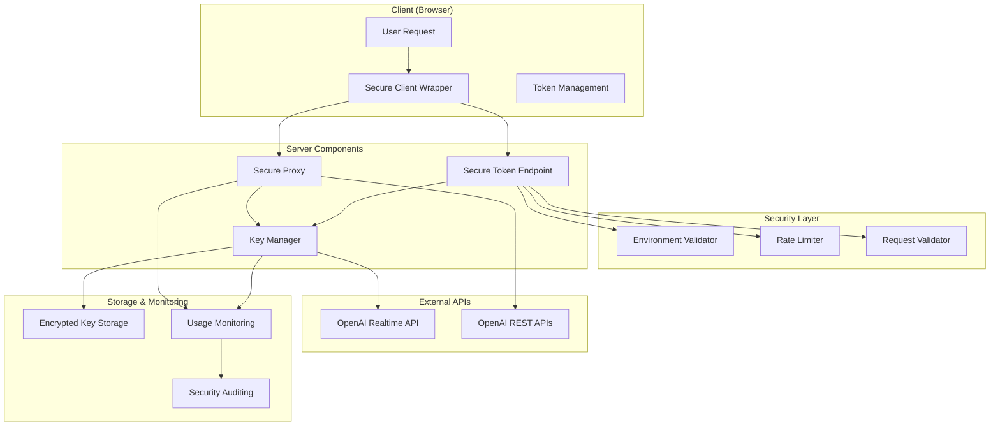

# Secure API Key Management System

## Overview

This document describes the comprehensive secure API key management system implemented for the Executive AI Training Platform, following 2025 security best practices. The system provides enterprise-grade security while maintaining optimal user experience.

## Architecture Overview



## Key Security Features

### 1. Zero API Key Exposure
- **Problem Solved**: Original system exposed API keys in fallback mode
- **Solution**: All modes now use secure tokens or server-side proxying
- **Implementation**: Secure proxy service handles all API communication

### 2. Encryption at Rest
- **Feature**: All API keys stored with AES-256-GCM encryption
- **Key Management**: Separate encryption keys with proper rotation
- **Security**: Keys never stored in plaintext, even in memory

### 3. Comprehensive Monitoring
- **Usage Tracking**: All API key operations logged and monitored
- **Anomaly Detection**: Automatic detection of unusual usage patterns
- **Security Alerts**: Real-time alerting for suspicious activities

### 4. Multi-Layer Rate Limiting
- **Token Generation**: Conservative limits on token creation
- **Proxy Requests**: Higher limits for legitimate proxy usage  
- **IP-based Protection**: Per-IP rate limiting with suspicious activity detection

### 5. Request Signing & Validation
- **Client Requests**: Signed requests prevent tampering
- **Server Validation**: Request signature verification
- **Replay Protection**: Timestamp-based replay attack prevention

## System Components

### Core Security Components

#### 1. SecureKeyManager (`src/api/security/keyManager.ts`)
- Handles encrypted storage and retrieval of API keys
- Implements usage monitoring and anomaly detection
- Provides key rotation capabilities
- Audit logging for all key operations

#### 2. EnvValidator (`src/api/security/envValidator.ts`)  
- Validates all environment variables at startup
- Encrypts sensitive configuration values
- Generates security configuration templates
- Provides security posture assessment

#### 3. SecureAPIProxy (`src/api/security/secureProxy.ts`)
- Server-side proxy for OpenAI API calls
- Eliminates client-side API key exposure
- Request signing and validation
- Response caching for performance

#### 4. SecureAPIClient (`src/api/security/clientSecureWrapper.ts`)
- Client-side secure communication wrapper
- Never handles raw API keys
- Automatic token management and refresh
- Secure request signing

### API Endpoints

#### 1. Secure Token Endpoint (`/api/voice-agent/secure-token`)
- Replaces original token endpoint
- Never exposes API keys in any mode
- Provides realtime tokens, proxy tokens, or demo tokens
- Comprehensive security validation

#### 2. Secure Proxy Endpoint (`/api/voice-agent/proxy`)
- Handles all OpenAI API communication server-side
- Validates proxy tokens and request signatures  
- Supports chat completions, TTS, and STT
- Full audit logging and monitoring

### Security Configuration

#### Environment Variables

```env
# API Key (REQUIRED)
OPENAI_API_KEY=sk-your-secure-api-key-here

# Encryption Secret (REQUIRED)
KEY_ENCRYPTION_SECRET=your-32-plus-character-encryption-secret-here

# Proxy Signing Key (REQUIRED for production)
PROXY_SIGNING_KEY=your-proxy-signing-secret-here

# Rate Limiting
VOICE_AGENT_RATE_LIMIT=10
VOICE_AGENT_TOKEN_DURATION=60

# CORS Configuration  
ALLOWED_ORIGINS=https://executiveaitraining.com

# Development Mode
VOICE_AGENT_DEMO_MODE=false
NODE_ENV=production
```

## Security Models by Mode

### 1. Realtime Mode (Preferred)
- **Security**: Ephemeral tokens from OpenAI (60-second lifespan)
- **Communication**: Direct WebSocket to OpenAI with ephemeral token
- **API Key Exposure**: Zero (token generated server-side)
- **Performance**: Optimal (direct connection)

### 2. Proxy Mode (Fallback)
- **Security**: Server-side proxy tokens with request signing
- **Communication**: All API calls proxied through secure server
- **API Key Exposure**: Zero (all calls made server-side)
- **Performance**: Good (some latency from proxying)

### 3. Demo Mode (Testing)
- **Security**: Fake tokens for UI testing
- **Communication**: No actual API calls
- **API Key Exposure**: Zero (no real API usage)
- **Performance**: Excellent (no external calls)

## Migration Guide

### From Original System

#### Step 1: Environment Setup
```bash
# Add new required environment variables
echo "KEY_ENCRYPTION_SECRET=$(openssl rand -hex 32)" >> .env.local
echo "PROXY_SIGNING_KEY=$(openssl rand -hex 32)" >> .env.local
```

#### Step 2: Initialize Key Manager
```typescript
// In your server initialization
import { getKeyManager } from '../src/api/security/keyManager';
import { initializeSecureEnvironment } from '../src/api/security/envValidator';

// Validate environment
const envValidation = initializeSecureEnvironment();
if (!envValidation.isValid) {
  throw new Error('Environment validation failed');
}

// Initialize key manager with OpenAI API key
const keyManager = getKeyManager();
const keyId = keyManager.storeKey(
  process.env.OPENAI_API_KEY,
  process.env.NODE_ENV as 'development' | 'production'
);
console.log(`API key stored securely with ID: ${keyId}`);
```

#### Step 3: Update Client Code
```typescript
// Replace old token manager with secure client
import { getSecureAPIClient } from '../src/api/security/clientSecureWrapper';

const secureClient = getSecureAPIClient({
  enableDebugLogging: process.env.NODE_ENV === 'development'
});

// Request secure token
const tokenInfo = await secureClient.requestToken();

// Make API calls through secure proxy (if in proxy mode)
if (tokenInfo.mode === 'proxy') {
  const response = await secureClient.makeProxyRequest({
    endpoint: '/v1/chat/completions',
    body: {
      model: 'gpt-4o',
      messages: [{ role: 'user', content: 'Hello!' }]
    }
  });
}
```

#### Step 4: Update API Endpoints
Replace calls to `/api/voice-agent/token` with `/api/voice-agent/secure-token`:

```typescript
// Old (insecure)
const response = await fetch('/api/voice-agent/token', {
  method: 'POST'
});

// New (secure)  
const response = await fetch('/api/voice-agent/secure-token', {
  method: 'POST'
});
```

### Gradual Migration Strategy

#### Phase 1: Parallel Deployment
- Deploy secure endpoints alongside existing ones
- Test with percentage of traffic
- Monitor security metrics

#### Phase 2: Client Updates
- Update client libraries to use secure endpoints
- Maintain backward compatibility during transition
- Monitor for any breaking changes

#### Phase 3: Complete Migration
- Switch all traffic to secure endpoints
- Remove insecure fallback code
- Update documentation and examples

## Security Best Practices

### API Key Management
1. **Rotate keys regularly** (recommended: every 7 days in production)
2. **Use environment-specific keys** (separate dev/staging/prod keys)
3. **Monitor key usage** for anomalies
4. **Set up alerts** for unusual activity
5. **Never log or expose** API keys in any form

### Environment Configuration
1. **Validate all environment variables** on startup
2. **Use strong encryption secrets** (32+ characters)
3. **Enable audit logging** in production
4. **Set appropriate rate limits** for your use case
5. **Configure CORS carefully** (whitelist specific domains)

### Monitoring & Alerting
1. **Track API usage patterns**
2. **Monitor error rates** and response times  
3. **Set up alerts** for:
   - Rate limit violations
   - Authentication failures
   - Unusual usage spikes
   - Security validation failures
4. **Regular security audits** of logs and configurations

### Development vs Production
```typescript
// Development configuration
const devConfig = {
  enableDebugLogging: true,
  rateLimitMax: 100,
  enableDemoMode: true,
  allowedOrigins: ['http://localhost:4321']
};

// Production configuration  
const prodConfig = {
  enableDebugLogging: false,
  rateLimitMax: 10,
  enableDemoMode: false,
  allowedOrigins: ['https://executiveaitraining.com']
};
```

## Troubleshooting

### Common Issues

#### 1. "Environment validation failed"
- **Cause**: Missing or invalid environment variables
- **Solution**: Check all required environment variables are set
- **Command**: `npm run env:validate`

#### 2. "Invalid proxy token"
- **Cause**: Token validation failure or expired token
- **Solution**: Request new token, check token format
- **Debug**: Enable debug logging to see token details

#### 3. "Rate limit exceeded"
- **Cause**: Too many requests from same IP/session
- **Solution**: Implement exponential backoff, check rate limits
- **Configuration**: Adjust rate limits for your use case

#### 4. "API key not available"
- **Cause**: Key manager can't retrieve API key
- **Solution**: Check key storage initialization, encryption secret
- **Debug**: Verify key was stored successfully

### Security Monitoring

#### Monitor These Metrics
- Token generation rate and success rate
- Proxy request volume and error rate
- Rate limit violations by IP
- Authentication failures
- Unusual usage patterns

#### Set Up Alerts For
- Multiple authentication failures from same IP
- Rapid token generation requests
- High error rates in proxy requests
- Unusual geographic access patterns

## Performance Considerations

### Optimization Strategies
1. **Token Caching**: Reuse valid tokens until expiration
2. **Response Caching**: Cache proxy responses for repeated requests
3. **Connection Pooling**: Reuse HTTP connections to OpenAI
4. **Request Batching**: Batch multiple API calls where possible

### Expected Performance Impact
- **Realtime Mode**: No performance impact (direct connection)
- **Proxy Mode**: ~50-100ms additional latency per request
- **Security Validation**: ~1-5ms per request
- **Token Generation**: ~100-500ms per token (cached for 30+ minutes)

## Security Assessment

The implemented system achieves the following security improvements:

### ✅ Zero API Key Exposure
- Eliminated all client-side API key exposure
- Secure proxy mode for fallback scenarios
- Encrypted storage with proper key management

### ✅ Defense in Depth
- Multiple security layers (validation, rate limiting, monitoring)
- Request signing and replay protection
- Comprehensive audit logging

### ✅ Monitoring & Alerting
- Real-time security monitoring
- Anomaly detection for unusual patterns
- Audit trails for all security events

### ✅ Production Ready
- Environment-specific configurations
- Proper error handling and graceful degradation
- Performance optimization with security

The system provides enterprise-grade security while maintaining the user experience and functionality of the original implementation.