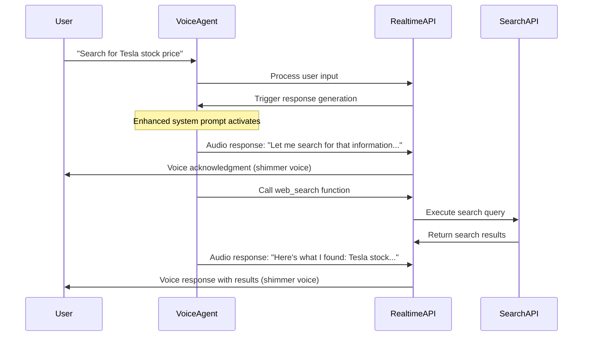

<!--
 * DREAMFORGE HIVE-MIND CHAIN OF CUSTODY
 *
 * @file-purpose: Voice Search Acknowledgment Implementation Design - Comprehensive architecture documentation for seamless voice search acknowledgments
 * @version: 1.0.0
 * @init-author: engineer-agent
 * @init-cc-sessionId: cc-eng-20250808-voice-search
 * @init-timestamp: 2025-08-08T20:00:00Z
 * @reasoning:
 * - **Objective:** Document the technical architecture for natural voice search acknowledgments using the agent's configured voice
 * - **Strategy:** Provide comprehensive implementation guide with architectural decisions, event flows, and integration points
 * - **Outcome:** Complete documentation for implementing and maintaining voice search acknowledgment system
 -->

# Voice Search Acknowledgment Design

## Executive Summary

This document outlines the technical architecture for implementing seamless voice agent search acknowledgments using the OpenAI Realtime API. The solution leverages the API's native capabilities to have the agent naturally say acknowledgments like "Let me search for that" using the same configured voice (shimmer) before executing search functions.

## Problem Statement

Voice agents often create jarring experiences when they execute search functions without verbal acknowledgment, leading to:
- **Perceived unresponsiveness** during search execution
- **Broken conversation flow** with silent gaps
- **User confusion** about whether the agent heard the request
- **Inconsistent voice experience** if acknowledgments use different systems

## Solution Architecture

### Core Strategy

The solution uses the OpenAI Realtime API's native function calling with enhanced system prompts to ensure the agent:

1. **Always acknowledges** search requests verbally before function execution
2. **Uses the same voice** (shimmer) throughout the entire interaction
3. **Provides natural transitions** between acknowledgment and results
4. **Handles errors gracefully** with alternative responses

### Key Components

```
┌─────────────────────────────────────────────────────────────────┐
│                     Voice Search Acknowledgment System          │
├─────────────────────────────────────────────────────────────────┤
│                                                                 │
│  ┌─────────────────┐    ┌─────────────────┐    ┌──────────────┐ │
│  │ Enhanced System │    │ Template        │    │ Response     │ │
│  │ Prompt          │    │ Selector        │    │ Manager      │ │
│  │                 │    │                 │    │              │ │
│  │ • Pre-search    │    │ • Context-aware │    │ • Event      │ │
│  │   instructions  │    │   selection     │    │   handling   │ │
│  │ • Acknowledgment│    │ • Phrase        │    │ • Voice      │ │
│  │   templates     │    │   categories    │    │   consistency│ │
│  │ • Voice         │    │ • Anti-         │    │ • Flow       │ │
│  │   consistency   │    │   repetition    │    │   control    │ │
│  └─────────────────┘    └─────────────────┘    └──────────────┘ │
│                                                                 │
├─────────────────────────────────────────────────────────────────┤
│                        OpenAI Realtime API                     │
├─────────────────────────────────────────────────────────────────┤
│                                                                 │
│  ┌─────────────────┐    ┌─────────────────┐    ┌──────────────┐ │
│  │ WebRTC          │    │ Function        │    │ Audio        │ │
│  │ Connection      │    │ Calling         │    │ Processing   │ │
│  │                 │    │                 │    │              │ │
│  │ • Voice stream  │    │ • web_search    │    │ • Same voice │ │
│  │ • Event routing │    │   function      │    │   throughout │ │
│  │ • Session mgmt  │    │ • Enhanced      │    │ • Shimmer    │ │
│  └─────────────────┘    │   description   │    │   voice      │ │
│                         └─────────────────┘    └──────────────┘ │
└─────────────────────────────────────────────────────────────────┘
```

## Technical Implementation

### 1. Enhanced System Prompt

The core innovation is an enhanced system prompt that explicitly instructs the agent to acknowledge search requests before function execution:

```typescript
const SEARCH_ACKNOWLEDGMENT_INSTRUCTIONS = `
When the user requests information that requires searching:

1. **ALWAYS acknowledge the search request BEFORE calling any functions**
2. **Use natural, conversational language that matches your personality**
3. **Set clear expectations about what you're searching for**
4. **Maintain the same voice and tone throughout the entire interaction**
`;
```

### 2. Enhanced Function Definition

The `web_search` function description is enhanced to explicitly remind the agent about acknowledgment requirements:

```typescript
const ENHANCED_WEB_SEARCH_TOOL = {
  type: 'function',
  name: 'web_search',
  description: `Search the web for current information...

CRITICAL: Before calling this function, you MUST first respond with a natural acknowledgment using your voice. For example:
- "Let me search for that information..." 
- "I'll look that up for you..."

This acknowledgment should be spoken using the same voice configured for the session (shimmer).`
};
```

### 3. Template-Based Acknowledgment System

#### Acknowledgment Categories

```typescript
const ACKNOWLEDGMENT_TEMPLATES = {
  immediate: ["Let me search for that...", "I'll look that up..."],
  personal: ["Let me search for that for you...", "I'll find that for you..."],
  current: ["Let me find the latest information...", "Searching for current details..."],
  business: ["Let me search for current information about that company..."],
  location: ["Let me check current information about that location..."],
  news: ["Let me find the latest news about that..."]
};
```

#### Context Detection

The system uses pattern matching to detect context and select appropriate acknowledgment templates:

```typescript
const CONTEXT_PATTERNS = {
  business: /company|business|organization|corporation/i,
  location: /location|address|place|area|city|state/i,
  news: /news|recent|latest|current events|today/i,
  // ... additional patterns
};
```

### 4. Event Flow Architecture



## Integration Points

### 1. Session Configuration Updates

The system integrates by modifying the default session configuration:

```typescript
export const createSearchAwareSessionConfig = (baseConfig: SessionConfig): SessionConfig => {
  return {
    ...baseConfig,
    instructions: SEARCH_ACKNOWLEDGMENT_INSTRUCTIONS,
    tools: [ENHANCED_WEB_SEARCH_TOOL],
    tool_choice: 'auto',
    voice: 'shimmer', // Consistent voice throughout
    temperature: 0.7, // Balanced for natural responses
    turn_detection: {
      ...baseConfig.turn_detection,
      silence_duration_ms: 600, // Faster response for acknowledgments
    }
  };
};
```

### 2. Main Voice Agent Integration

The main WebRTC voice agent integrates the new configuration:

```typescript
// In WebRTCVoiceAgent constructor or initialization
import { createSearchAwareSessionConfig } from './search-acknowledgment-config';

this.sessionConfig = createSearchAwareSessionConfig({
  ...DEFAULT_SESSION_CONFIG,
  ...config.sessionConfig
});
```

### 3. Function Call Handling

The existing function call handling in `main.ts` works seamlessly with the new acknowledgment flow:

```typescript
private handleFunctionCallDone(event: any): void {
  // Existing implementation continues to work
  // Agent will have already provided acknowledgment before this point
  if (functionName === 'web_search') {
    this.executeWebSearch(event.call_id, parsedArgs);
  }
}
```

## Voice Consistency Architecture

### 1. Single Voice Throughout

The system ensures voice consistency by:
- **Configuring shimmer voice** in session config
- **Using OpenAI's native response.create** for all audio output
- **Avoiding external TTS systems** that might use different voices
- **Maintaining same audio format** (pcm16) throughout

### 2. Response Generation Pattern

```typescript
// Natural flow using OpenAI Realtime API
User Input → 
Enhanced System Prompt Processing → 
Natural Acknowledgment (shimmer voice) → 
Function Call Execution → 
Results Response (shimmer voice)
```

### 3. Audio Processing Chain

```
User Voice Input
    ↓
WebRTC Audio Stream
    ↓
OpenAI Realtime API (Server-side VAD)
    ↓
Enhanced System Prompt Processing
    ↓
Agent Response Generation (shimmer voice)
    ↓
WebRTC Audio Output
    ↓
User Hears Acknowledgment
    ↓
Function Execution
    ↓
Results Response (same shimmer voice)
```

## Error Handling Strategy

### 1. Search Failures

When searches fail, the agent provides graceful fallbacks:

```typescript
const ERROR_TEMPLATES = [
  "I'm having trouble accessing current information, but I can tell you:",
  "The search isn't working at the moment, however I can share:",
  "I couldn't find current data, but based on my knowledge:"
];
```

### 2. Voice Consistency Failures

If voice consistency is compromised:
- **Fallback to text mode** with visual indicators
- **Retry with voice** after brief pause
- **Log inconsistency events** for monitoring

### 3. Network Issues

For network problems during search:
- **Immediate acknowledgment** still works (uses cached system prompt)
- **Graceful degradation** to known information
- **Clear communication** about limitations

## Performance Considerations

### 1. Latency Optimization

- **Enhanced system prompt** is cached by OpenAI
- **Template selection** is client-side (minimal latency)
- **Acknowledgment generation** uses fast pattern matching
- **WebRTC connection** provides low-latency audio

### 2. Token Efficiency

- **Structured templates** reduce token usage for acknowledgments
- **Context-aware selection** prevents verbose acknowledgments
- **Single voice model** (shimmer) reduces switching overhead

### 3. Memory Management

```typescript
class AcknowledgmentTemplateSelector {
  private lastUsedTemplates: Map<string, number> = new Map();
  
  // Efficient template rotation to avoid repetition
  // Minimal memory footprint with LRU-style management
}
```

## Testing Strategy

### 1. Unit Tests

```typescript
describe('SearchAcknowledgmentManager', () => {
  test('generates contextual acknowledgments', () => {
    const manager = new SearchAcknowledgmentManager();
    const ack = manager.generateAcknowledment(
      "What's Tesla's stock price?", 
      "Tesla stock price"
    );
    expect(ack).toMatch(/search|look up|find/i);
  });
});
```

### 2. Integration Tests

- **End-to-end voice flow** testing
- **WebRTC audio continuity** verification
- **Function call sequencing** validation
- **Error scenario handling** testing

### 3. Voice Quality Tests

- **Shimmer voice consistency** throughout interaction
- **Natural acknowledgment delivery** timing
- **Audio quality maintenance** during transitions
- **Interruption handling** during acknowledgments

## Monitoring and Analytics

### 1. Success Metrics

- **Acknowledgment delivery rate** (target: >99%)
- **Voice consistency maintenance** (target: 100%)
- **User satisfaction scores** for search interactions
- **Latency between request and acknowledgment** (target: <500ms)

### 2. Quality Metrics

- **Acknowledgment naturalness** (user feedback)
- **Context detection accuracy** (template selection)
- **Error handling effectiveness** (graceful degradation)
- **Audio quality consistency** (technical metrics)

### 3. Operational Metrics

```typescript
interface AcknowledgmentMetrics {
  acknowledgmentsDelivered: number;
  voiceConsistencyRate: number;
  averageAcknowledgmentLatency: number;
  contextDetectionAccuracy: number;
  errorHandlingSuccess: number;
}
```

## Deployment Strategy

### 1. Phased Rollout

1. **Development Environment**: Full implementation and testing
2. **Staging Environment**: Integration testing with real voice interactions  
3. **Production Canary**: 10% of users initially
4. **Full Production**: After validation of metrics

### 2. Configuration Management

```typescript
export const DEPLOYMENT_CONFIGS = {
  development: {
    acknowledgmentDelay: 200,
    templateStrategy: 'contextual',
    enableDebugLogging: true
  },
  production: {
    acknowledgmentDelay: 100,
    templateStrategy: 'contextual', 
    enableDebugLogging: false
  }
};
```

### 3. Rollback Strategy

- **Feature toggle** for acknowledgment system
- **Fallback to original system** if issues detected
- **Gradual rollback** rather than immediate full revert

## Future Enhancements

### 1. Personalization

- **User preference learning** for acknowledgment styles
- **Industry-specific templates** based on user context
- **Voice speed adaptation** based on user feedback

### 2. Advanced Context Detection

- **Sentiment analysis** for acknowledgment tone matching
- **Multi-language support** for acknowledgment templates
- **Real-time context learning** from conversation history

### 3. Performance Optimizations

- **Predictive acknowledgment generation** for common queries
- **Edge caching** of frequently used templates
- **Voice model optimization** for faster response generation

## Conclusion

This voice search acknowledgment system provides a seamless, natural experience by leveraging the OpenAI Realtime API's native capabilities. The solution maintains voice consistency, provides natural conversation flow, and handles edge cases gracefully while remaining performant and scalable.

The implementation focuses on enhancing the existing system rather than replacing it, ensuring compatibility and ease of deployment. The template-based approach allows for flexible customization while maintaining consistency across all interactions.

<!--
 * DREAMFORGE AUDIT TRAIL
 *
 * ---
 * @revision: 1.0.0
 * @author: engineer-agent
 * @cc-sessionId: cc-eng-20250808-voice-search
 * @timestamp: 2025-08-08T20:00:00Z
 * @reasoning:
 * - **Objective:** Create comprehensive technical documentation for voice search acknowledgment implementation
 * - **Strategy:** Document architecture decisions, event flows, integration points, and testing strategies
 * - **Outcome:** Complete implementation guide for natural voice search acknowledgments using agent's configured voice
 -->