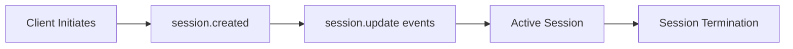

# WebRTC Session Persistence Research for OpenAI Realtime API Voice Agents (2025)

## Executive Summary

This research document compiles the latest best practices for WebRTC session persistence in 2025, with specific focus on OpenAI Realtime API voice agents. The findings emphasize the critical importance of maintaining session continuity across page navigation, implementing robust reconnection strategies, and leveraging appropriate browser storage mechanisms for optimal user experience in voice AI applications.

## 1. WebRTC Session Persistence Best Practices (2025)

### 1.1 Core Session Management Strategies

#### Sticky Sessions and Distributed State
- **Sticky Sessions**: Maintain user connections to the same server throughout their experience to minimize disruptions
- **Distributed Databases**: Use distributed state management to provide redundancy and prevent data loss during peak loads
- **Resource Optimization**: Distributed databases can reduce system strain by up to 25% during peak times through proper session releases

#### Optimal Session Duration
- **8-hour Rule**: Research indicates 8 hours is the optimal maximum duration for long WebRTC sessions
- **Session Splitting**: For sessions exceeding 8 hours, implement logical session splitting without closing the underlying WebRTC connection
- **Internal Session Management**: Split long sessions into shorter logical sessions while maintaining the same peer connection

### 1.2 Advanced Persistence Mechanisms

#### Persistent Connection Architecture
```javascript
// Conceptual implementation for session splitting
class PersistentWebRTCSession {
  constructor() {
    this.peerConnection = new RTCPeerConnection();
    this.currentLogicalSession = null;
    this.sessionHistory = [];
  }

  splitSession() {
    // Close logical session without closing peer connection
    this.closeLogicalSession();
    // Create new logical session with same connection
    this.createNewLogicalSession();
  }
}
```

#### Timeout and Resource Management
- **Proactive Monitoring**: Regularly assess session activity levels
- **Graceful Termination**: Terminate inactive sessions to free resources
- **Automatic Cleanup**: Implement timeout strategies to prevent server overload

### 1.3 Security and Authentication Framework

#### Multi-layered Security Approach
- **Application-level Authentication**: Robust user authentication and authorization
- **Session Validation**: Continuous validation of user sessions
- **Anomaly Detection**: Monitor activity patterns for threat detection
- **Automatic Termination**: End sessions when threats detected or users inactive

#### Encryption and Protocol Security
- **HTTPS/WSS**: Use secure signaling protocols for all handshake processes
- **DTLS/SRTP**: Apply end-to-end encryption with forward secrecy
- **Role-Based Access Control (RBAC)**: Implement granular permission systems
- **Credential Rotation**: Regular rotation of STUN/TURN server credentials

## 2. OpenAI Realtime API Session Management

### 2.1 Session Architecture Overview

The OpenAI Realtime API provides stateful connections between OpenAI and clients, managing conversation context automatically with significant benefits for developers.

#### Session Lifecycle


#### Key Limitations
- **Maximum Context**: 128,000 tokens per session
- **Session Duration**: 15-minute maximum per session
- **Token Management**: Audio conversations rarely hit token limits

### 2.2 WebRTC Integration Benefits

#### Why WebRTC for Realtime API
- **Lower Latency**: Optimized for real-time audio/video communication
- **Media Handling**: Built-in support for audio codecs
- **Network Adaptation**: Automatic bandwidth and packet loss handling
- **Echo Cancellation**: Advanced noise reduction and automatic gain control

#### Technical Advantages
```javascript
// WebRTC connection setup for Realtime API
const peerConnection = new RTCPeerConnection({
  iceServers: [
    { urls: 'stun:stun.l.google.com:19302' },
    { urls: 'turn:your-turn-server.com', username: 'user', credential: 'pass' }
  ]
});

// Handle connection state changes
peerConnection.addEventListener('connectionstatechange', () => {
  console.log('Connection state:', peerConnection.connectionState);
  if (peerConnection.connectionState === 'failed') {
    handleReconnection();
  }
});
```

### 2.3 Ephemeral Key Management

#### Authentication Flow
1. **UI → Server**: Request ephemeral key
2. **Server → OpenAI**: Create session via `https://api.openai.com/v1/realtime/sessions`
3. **Server → UI**: Return ephemeral key and session parameters

#### Key Characteristics
- **Duration**: 1 minute validity (some sources report 2-hour TTL)
- **Security**: Short-lived tokens prevent API key exposure
- **Session Binding**: One-time use for WebRTC connection establishment

### 2.4 Data Channel Communication

The Realtime API uses WebRTC data channels for:
- Text responses and audio segments
- Function calls and interruptions
- Bidirectional event messaging
- Session configuration updates

## 3. WebRTC Reconnection Strategies for Single Page Applications

### 3.1 Connection State Monitoring

#### Critical States to Monitor
```javascript
const monitorConnectionStates = (peerConnection) => {
  peerConnection.addEventListener('iceconnectionstatechange', () => {
    const state = peerConnection.iceConnectionState;
    
    switch(state) {
      case 'new':
      case 'checking':
      case 'connected':
      case 'completed':
        // Normal states - continue monitoring
        break;
      case 'disconnected':
        // Trigger reconnection attempt
        handleDisconnection();
        break;
      case 'failed':
        // Immediate recovery needed
        handleConnectionFailure();
        break;
    }
  });
};
```

#### Watchdog Mechanism
- **Dual Monitoring**: Track both signaling and ICE connection state changes
- **Timeout Detection**: 2-3 seconds maximum before triggering recovery
- **Proactive Recovery**: Avoid long delays through early intervention

### 3.2 ICE Restart as Primary Recovery

ICE restart is the fundamental and only recovery mechanism available in WebRTC:

```javascript
const performICERestart = async (peerConnection) => {
  try {
    // Create offer with ICE restart
    const offer = await peerConnection.createOffer({ iceRestart: true });
    await peerConnection.setLocalDescription(offer);
    
    // Send offer through signaling channel
    sendSignalingMessage({ type: 'offer', sdp: offer });
  } catch (error) {
    console.error('ICE restart failed:', error);
    // Fallback to full connection restart
    recreateConnection();
  }
};
```

### 3.3 Single Page Application Advantages

#### Persistent Connection Benefits
- **No Page Reloads**: Maintains WebRTC sessions throughout navigation
- **Background Monitoring**: Continuous connection state tracking
- **Seamless Updates**: UI changes without media stream disruption
- **Resource Efficiency**: Avoid repeated connection establishment

#### Implementation Strategy
```javascript
class SPAWebRTCManager {
  constructor() {
    this.connection = null;
    this.reconnectionAttempts = 0;
    this.maxReconnectionAttempts = 5;
    this.setupSignalingPersistence();
  }

  setupSignalingPersistence() {
    // Keep signaling open even after peer connection established
    this.signalingChannel.onclose = () => {
      this.attemptSignalingReconnection();
    };
  }

  handlePageNavigation() {
    // SPA navigation doesn't affect WebRTC connection
    // Update UI without disrupting media streams
    this.updateUIContext();
  }
}
```

## 4. Voice Assistant Session Continuity Across Page Navigation

### 4.1 Browser Storage Options

#### SessionStorage Implementation
```javascript
class VoiceSessionManager {
  constructor() {
    this.sessionKey = 'voice_assistant_session';
  }

  saveSessionState(state) {
    try {
      sessionStorage.setItem(this.sessionKey, JSON.stringify(state));
    } catch (error) {
      console.error('Failed to save session state:', error);
      this.fallbackToMemoryStorage(state);
    }
  }

  restoreSessionState() {
    try {
      const stored = sessionStorage.getItem(this.sessionKey);
      return stored ? JSON.parse(stored) : null;
    } catch (error) {
      console.error('Failed to restore session state:', error);
      return null;
    }
  }

  clearSession() {
    sessionStorage.removeItem(this.sessionKey);
  }
}
```

#### Storage Option Comparison

| Storage Type | Persistence | Scope | Capacity | Use Case |
|--------------|-------------|--------|-----------|-----------|
| sessionStorage | Tab session | Single tab | ~5-10MB | Short-term session data |
| localStorage | Permanent | Origin-wide | ~5-10MB | User preferences, long-term state |
| IndexedDB | Permanent | Origin-wide | Large (GB+) | Audio buffers, conversation history |

### 4.2 Session State Serialization

#### Comprehensive State Management
```javascript
const serializeVoiceSession = (session) => {
  return {
    sessionId: session.id,
    conversationHistory: session.history,
    userPreferences: session.preferences,
    connectionState: {
      isConnected: session.connection.state === 'connected',
      lastHeartbeat: session.lastHeartbeat,
      reconnectionCount: session.reconnectionCount
    },
    audioState: {
      isMuted: session.audioManager.isMuted,
      volume: session.audioManager.volume,
      deviceId: session.audioManager.selectedDevice
    },
    timestamp: Date.now()
  };
};

const deserializeVoiceSession = (serialized) => {
  // Validate data integrity
  if (!serialized || !serialized.sessionId) {
    return null;
  }

  // Reconstruct session with validation
  return new VoiceSession({
    id: serialized.sessionId,
    history: serialized.conversationHistory || [],
    preferences: serialized.userPreferences || {},
    // Note: Connection state needs re-establishment
    reconnectionCount: serialized.connectionState?.reconnectionCount || 0
  });
};
```

### 4.3 Cross-Page Communication

#### Service Worker Implementation
```javascript
// service-worker.js
self.addEventListener('message', (event) => {
  if (event.data.type === 'VOICE_SESSION_UPDATE') {
    // Broadcast session updates to all tabs
    self.clients.matchAll().then(clients => {
      clients.forEach(client => {
        if (client.id !== event.source.id) {
          client.postMessage({
            type: 'VOICE_SESSION_SYNC',
            data: event.data.session
          });
        }
      });
    });
  }
});

// main.js
navigator.serviceWorker.ready.then(registration => {
  registration.active.postMessage({
    type: 'VOICE_SESSION_UPDATE',
    session: currentVoiceSession
  });
});
```

## 5. Security Considerations for Storing Session Tokens

### 5.1 Token Security Framework

#### Ephemeral Token Handling
```javascript
class SecureTokenManager {
  constructor() {
    this.tokenStorage = new Map();
    this.tokenExpiry = new Map();
  }

  storeEphemeralToken(sessionId, token, expiryMs = 60000) {
    // Store in memory only, never in persistent storage
    this.tokenStorage.set(sessionId, token);
    this.tokenExpiry.set(sessionId, Date.now() + expiryMs);
    
    // Auto-cleanup expired tokens
    setTimeout(() => {
      this.clearToken(sessionId);
    }, expiryMs);
  }

  getToken(sessionId) {
    const expiry = this.tokenExpiry.get(sessionId);
    if (!expiry || Date.now() > expiry) {
      this.clearToken(sessionId);
      return null;
    }
    return this.tokenStorage.get(sessionId);
  }

  clearToken(sessionId) {
    this.tokenStorage.delete(sessionId);
    this.tokenExpiry.delete(sessionId);
  }
}
```

### 5.2 Storage Security Best Practices

#### Secure Storage Guidelines
1. **Never Store API Keys**: Keep primary API keys server-side only
2. **Ephemeral Token Only**: Store only short-lived session tokens
3. **Memory Priority**: Prefer in-memory storage over persistent storage
4. **Encryption**: Encrypt sensitive data before storage
5. **Regular Cleanup**: Implement automatic token expiration

#### Content Security Policy
```javascript
// CSP headers for voice assistant applications
const cspConfig = {
  'default-src': "'self'",
  'connect-src': "'self' wss://api.openai.com https://api.openai.com",
  'media-src': "'self' blob:",
  'worker-src': "'self' blob:",
  'script-src': "'self' 'unsafe-inline'", // Minimize inline scripts
};
```

### 5.3 GDPR and Privacy Compliance

#### Data Protection Measures
```javascript
class PrivacyCompliantVoiceSession {
  constructor() {
    this.userConsent = false;
    this.dataRetentionPeriod = 24 * 60 * 60 * 1000; // 24 hours
  }

  async requestUserConsent() {
    return new Promise((resolve) => {
      // Show consent dialog
      this.showConsentDialog({
        onAccept: () => {
          this.userConsent = true;
          this.logConsentGiven();
          resolve(true);
        },
        onDecline: () => {
          this.userConsent = false;
          resolve(false);
        }
      });
    });
  }

  storeWithConsent(data) {
    if (!this.userConsent) {
      throw new Error('User consent required for data storage');
    }

    const encryptedData = this.encrypt(data);
    const expiryTime = Date.now() + this.dataRetentionPeriod;
    
    sessionStorage.setItem('voice_data', JSON.stringify({
      data: encryptedData,
      expires: expiryTime,
      consent: true
    }));
  }

  encrypt(data) {
    // Implement client-side encryption
    // Note: For production, use Web Crypto API
    return btoa(JSON.stringify(data));
  }
}
```

## 6. Implementation Recommendations for OpenAI Realtime API

### 6.1 Architecture Pattern

#### Recommended Implementation Flow
```javascript
class OpenAIRealtimeVoiceApp {
  constructor() {
    this.sessionManager = new VoiceSessionManager();
    this.connectionManager = new WebRTCConnectionManager();
    this.tokenManager = new SecureTokenManager();
    this.reconnectionStrategy = new ReconnectionStrategy();
  }

  async initializeSession() {
    // 1. Request ephemeral token from server
    const ephemeralToken = await this.requestEphemeralToken();
    
    // 2. Store token securely (memory only)
    this.tokenManager.storeEphemeralToken(this.sessionId, ephemeralToken);
    
    // 3. Establish WebRTC connection
    await this.connectionManager.connect(ephemeralToken);
    
    // 4. Setup session persistence
    this.setupSessionPersistence();
    
    // 5. Enable reconnection monitoring
    this.reconnectionStrategy.enable();
  }

  setupSessionPersistence() {
    // Save session state on key events
    this.connectionManager.on('statechange', (state) => {
      this.sessionManager.saveSessionState({
        connectionState: state,
        timestamp: Date.now()
      });
    });

    // Handle page navigation
    window.addEventListener('beforeunload', () => {
      this.gracefulDisconnect();
    });

    // Restore session on page load
    window.addEventListener('load', () => {
      this.attemptSessionRestore();
    });
  }
}
```

### 6.2 Error Handling and Recovery

#### Comprehensive Error Management
```javascript
class RobustVoiceConnection {
  constructor() {
    this.maxRetries = 3;
    this.retryDelay = 1000;
    this.exponentialBackoff = true;
  }

  async handleConnectionError(error) {
    console.error('Connection error:', error);
    
    switch(error.type) {
      case 'ice-connection-failed':
        await this.attemptICERestart();
        break;
      case 'signaling-disconnected':
        await this.reconnectSignaling();
        break;
      case 'token-expired':
        await this.refreshToken();
        break;
      case 'network-error':
        await this.waitForNetwork();
        break;
      default:
        await this.fullReconnection();
    }
  }

  async attemptICERestart() {
    try {
      await this.peerConnection.restartIce();
      console.log('ICE restart successful');
    } catch (error) {
      console.error('ICE restart failed:', error);
      await this.fullReconnection();
    }
  }

  async fullReconnection() {
    let attempts = 0;
    while (attempts < this.maxRetries) {
      try {
        await this.disconnect();
        await this.delay(this.calculateBackoff(attempts));
        await this.connect();
        return;
      } catch (error) {
        attempts++;
        console.error(`Reconnection attempt ${attempts} failed:`, error);
      }
    }
    throw new Error('Max reconnection attempts exceeded');
  }

  calculateBackoff(attempt) {
    return this.exponentialBackoff 
      ? this.retryDelay * Math.pow(2, attempt)
      : this.retryDelay;
  }
}
```

### 6.3 Performance Optimization

#### Connection Health Monitoring
```javascript
class ConnectionHealthMonitor {
  constructor() {
    this.healthMetrics = {
      latency: [],
      packetLoss: 0,
      connectionQuality: 'unknown'
    };
    this.monitoringInterval = null;
  }

  startMonitoring(peerConnection) {
    this.monitoringInterval = setInterval(async () => {
      const stats = await peerConnection.getStats();
      this.analyzeStats(stats);
      this.adjustQualitySettings();
    }, 5000);
  }

  analyzeStats(stats) {
    stats.forEach(report => {
      if (report.type === 'inbound-rtp' && report.mediaType === 'audio') {
        const packetLoss = report.packetsLost / report.packetsReceived;
        this.healthMetrics.packetLoss = packetLoss;
        
        if (packetLoss > 0.05) { // 5% packet loss
          console.warn('High packet loss detected:', packetLoss);
          this.triggerQualityAdjustment();
        }
      }
    });
  }

  adjustQualitySettings() {
    if (this.healthMetrics.packetLoss > 0.1) {
      // Reduce audio quality to improve stability
      this.requestQualityReduction();
    }
  }
}
```

## 7. Conclusion and Best Practices Summary

### Key Recommendations

1. **Session Architecture**
   - Use WebRTC for low-latency voice communication
   - Implement session splitting for long-duration conversations
   - Maintain persistent connections in Single Page Applications

2. **Storage Strategy**
   - Use sessionStorage for temporary session data
   - Implement IndexedDB for large conversation histories
   - Never store primary API keys client-side
   - Encrypt sensitive data before storage

3. **Reconnection Management**
   - Monitor ICE connection state changes continuously
   - Implement ICE restart as primary recovery mechanism
   - Use exponential backoff for reconnection attempts
   - Maintain signaling channel persistence

4. **Security Implementation**
   - Use ephemeral tokens with short expiration
   - Implement proper Content Security Policy
   - Ensure GDPR compliance with user consent
   - Regular security audits and credential rotation

5. **Performance Optimization**
   - Monitor connection health metrics
   - Implement adaptive quality adjustment
   - Use connection pooling where appropriate
   - Optimize for mobile network conditions

### Implementation Checklist

- [ ] Set up ephemeral token management system
- [ ] Implement WebRTC connection with reconnection strategies
- [ ] Create session persistence layer with appropriate storage
- [ ] Add comprehensive error handling and recovery
- [ ] Implement security measures and privacy compliance
- [ ] Add connection health monitoring
- [ ] Test across different network conditions
- [ ] Validate session continuity across page navigation
- [ ] Implement graceful degradation for connection issues
- [ ] Add comprehensive logging and monitoring

This research provides a foundation for building robust, secure, and user-friendly voice AI applications using the OpenAI Realtime API with WebRTC session persistence in 2025.

---
*Document compiled from industry research and best practices as of January 2025*